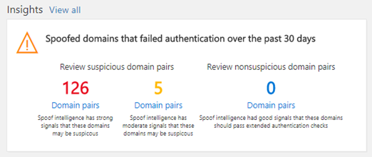

# Passo a passo: informações sobre spoof Intelligence

Usando a compreensão de inteligência de falsificação, você pode determinar rapidamente quais remetentes estão enviando legitimamente emails não autenticados. Ao permitir que eles enviem mensagens falsificadas, você pode reduzir o risco de qualquer falso positivo para os seus usuários.
  
Além disso, você também pode usar o monitor de inteligência de falsificação e gerenciar os pares de domínios permitidos para fornecer uma camada adicional de segurança e impedir que mensagens não seguras cheguem à sua organização.
  
Você pode usar a compreensão de inteligência de falsificação &amp; no centro de conformidade de segurança se sua conta corporativa ou de estudante recebeu permissões de administrador global, administrador de segurança ou leitor de segurança do Office 365. Para obter mais informações, consulte [permissões no centro de conformidade &amp; de segurança do Office 365](permissions-in-the-security-and-compliance-center.md).
  
Se você for novo para [relatórios e insights no centro de conformidade de &amp; segurança do Office 365](reports-and-insights-in-security-and-compliance.md), poderá ajudar a ver como você pode navegar facilmente de um painel para uma percepção e ações recomendadas.
  
Você pode exibir a percepção de inteligência de falsificação de mais de um painel &amp; no centro de conformidade de segurança. Independentemente de qual painel você está vendo, a percepção fornece os mesmos detalhes e permite que você realize rapidamente as mesmas tarefas.
  
Esta é uma das várias orientações passo a passo para &amp; o centro de conformidade de segurança. Para sobre como navegar por relatórios e insights, consulte as orientações na seção Tópicos relacionados.
  
## Como obter a percepção de inteligência de falsificação &amp; no centro de conformidade de segurança

1. Para começar, você precisará [ir para o centro de &amp; conformidade de segurança](go-to-the-securitycompliance-center.md).
    
2. No centro de &amp; conformidade de segurança, vá para painel de **Gerenciamento** \> de ameaças **.**
    
3. Na linha **** insights, procure o spoof Intelligence percepção. Se você tiver habilitado a inteligência de falsificação, a percepção terá **domínios falsificados que falharam na autenticação dos últimos 30 dias**. Se você ainda não habilitou a proteção contra falsificação, a percepção solicitará que você faça isso usando o título **habilitar proteção contra falsificação**. 
    
## Sobre a percepção do painel

A percepção do painel mostra as informações como esta.
  

  
Esta percepção tem dois modos:
  
 **Modo de percepção**. Se você tiver uma política de falsificação habilitada, a percepção mostrará quantas mensagens foram impactadas por nossos recursos de inteligência de fraude nos últimos 30 dias. 
  
 **Se Mode**. Se você não tiver uma política de falsificação habilitada, a percepção mostrará a você quantos ** emails teriam sido afetados por nossos recursos de inteligência de fraude nos últimos 30 dias. 
  
De qualquer forma, os domínios falsificados exibidos na percepção são separados em duas categorias; pares de domínios suspeitos e pares de domínios não suspeitos. Essas categorias são subdivididas em três buckets diferentes para revisão. 
  
Um *par de domínio* é uma combinação do endereço "de:" e da infraestrutura de envio. 
  
- O endereço "de" é o endereço exibido como o endereço de pelo seu aplicativo de email. Esse endereço identifica o autor do email. Ou seja, a caixa de correio da pessoa ou do sistema responsável por gravar a mensagem. Isso às vezes é chamado de endereço 5322. from.
    
- A infraestrutura de envio, ou remetente, é o domínio organizacional do registro PTR do endereço IP de envio. Se o endereço IP de envio não tiver um registro PTR, o remetente será identificado pelo IP de envio com a máscara de sub-rede 255.255.255.0 em notação CIDR (/24). Por exemplo, se o endereço IP for 192.168.100.100, o endereço IP completo do remetente será 192.168.100.100/24.
    
 Os **pares de domínios suspeitos** incluem: 
  
- **Falsificação de alta confiabilidade**. O Office 365 recebeu sinais fortes que esses domínios são suspeitos, com base nos padrões de envio históricos e na pontuação de reputação dos domínios. O Office 365 tem certeza de que os domínios estão falsificando e que as mensagens enviadas desses domínios têm menos probabilidade de serem legítimas. 
    
- **Falsificação de confiança moderada**. O Office 365 recebeu sinais moderados de que esses domínios são suspeitos, com base nos padrões de envio históricos e na pontuação de reputação dos domínios. O Office 365 está razoavelmente seguro de que os domínios estão falsificando e que as mensagens enviadas desses domínios são legítimas. Esse Bucket tem uma chance maior de conter falsos positivos (FPs) do que o Bucket de falsificação de alta confiança. 
    
 **Pares de domínios não suspeitos** incluem **falsificação recuperada**. A falsificação recuperada são domínios que falharam nas verificações de autenticação explícitas ( [SPF](https://docs.microsoft.com/office365/SecurityCompliance/how-office-365-uses-spf-to-prevent-spoofing), [DKIM](https://docs.microsoft.com/office365/SecurityCompliance/use-dkim-to-validate-outbound-email), [DMARC](https://docs.microsoft.com/office365/SecurityCompliance/use-dmarc-to-validate-email)), mas passaram em nossas verificações de autenticação estendidas. Como resultado, o Office 365 resmeteu o email em seu nome e nenhuma ação de anti-falsificação foi tomada no email. 
  
## Exibir informações detalhadas sobre pares de domínio suspeitos da compreensão da inteligência de falsificação

1. Na percepção de inteligência de falsificação, clique em qualquer um dos pares de domínio (alto, moderado ou cogatado).
  
A página de **informações sobre spoof Intelligence** aparece mostrando uma lista de remetentes que estão enviando emails não autenticados para sua organização. As informações nesta página ajudam a determinar se mensagens falsificadas são autorizadas ou não ou se você precisa tomar mais ações. Você pode classificar as informações por contagem de mensagens, a data em que a falsificação foi detectada pela última vez e muito mais. (Clique em cabeçalhos de coluna, como **contagem de mensagens** ou **última vista**, por exemplo). 
    
2. Selecione um item na tabela para abrir um painel de detalhes que contenha informações avançadas sobre o par de domínio, incluindo por que detectamos isso, o que você precisa fazer, um resumo de domínio, dados de WhoIs sobre o remetente e emails semelhantes que vimos no seu locatário do mesmo remetente. A partir daqui, você também pode optar por adicionar ou remover o par de domínio da lista de remetentes confiáveis do **AllowedToSpoof** . 
  

  
## Adicionar ou remover um domínio da lista de remetentes confiáveis do AllowedToSpoof

Você adiciona ou remove um domínio da lista de remetentes confiáveis do AllowedToSpoof ao examinar o par de domínios no painel de detalhes da percepção de inteligência de falsificação. Basta definir a opção de alternância.
  
Isso modifica a combinação exclusiva de par de domínio do domínio falsificado e da infraestrutura de envio e não fornece cobertura para todo o domínio falsificado ou para a infraestrutura de envio isoladamente. Por exemplo, se você adicionar o seguinte par de domínios à lista de permissões de remetente "AllowedToSpoof": *domínio falsificado* "gmail.com" e de *envio de infraestrutura* "TMS *. MX.com",* somente os emails desse par de domínio poderão ser falsificados. Outros remetentes que tentam falsificar "gmail.com" e outros domínios que "tms.mx.com" tentam falsificar continuarão a ser protegidos por spoof Intelligence. 
  
## Tópicos relacionados

[Saiba mais sobre a inteligência de falsificação](learn-about-spoof-intelligence.md)
  
[Proteção antifalsificação no Office 365](anti-spoofing-protection.md)
  
[Passo a passo – de um painel para um insight](from-a-dashboard-to-an-insight.md)
  
[Passo a passo – De um relatório detalhado para um insight](from-a-detailed-report-to-an-insight.md)
  
[Passo a passo – de um insight para um relatório detalhado](from-an-insight-to-a-detailed-report.md)
  

