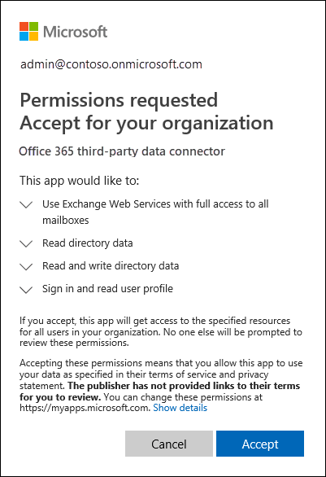

# <a name="work-with-a-partner-to-archive-third-party-data-in-office-365"></a><span data-ttu-id="bc3f9-104">Trabalhar com um parceiro para arquivar dados de terceiros no Office 365</span><span class="sxs-lookup"><span data-stu-id="bc3f9-104">Work with a partner to archive third-party data in Office 365</span></span>

<span data-ttu-id="bc3f9-105">Você pode trabalhar com um parceiro da Microsoft para importar e arquivar dados de uma fonte de dados de terceiros para o Office 365.</span><span class="sxs-lookup"><span data-stu-id="bc3f9-105">You can work with a Microsoft Partner to import and archive data from a third-party data source to Office 365.</span></span> <span data-ttu-id="bc3f9-106">Um parceiro pode fornecer um conector personalizado configurado para extrair itens da fonte de dados de terceiros (regularmente) e, em seguida, importar esses itens para o Office 365.</span><span class="sxs-lookup"><span data-stu-id="bc3f9-106">A partner can provide you with an custom connector that is configured to extract items from the third-party data source (on a regular basis) and then import those items to Office 365.</span></span> <span data-ttu-id="bc3f9-107">O conector de parceiro converte o conteúdo de um item da fonte de dados em um formato de mensagem de email e, em seguida, armazena os itens em caixas de correio no Office 365.</span><span class="sxs-lookup"><span data-stu-id="bc3f9-107">The partner connector converts the content of an item from the data source to an email message format and then stores the items in mailboxes in Office 365.</span></span> <span data-ttu-id="bc3f9-108">Após a importação dos dados de terceiros, você pode aplicar recursos de conformidade do Office 365, como retenção de litígio, pesquisa de conteúdo, arquivamento in-loco, auditoria e políticas de retenção do Office 365 — para esses dados.</span><span class="sxs-lookup"><span data-stu-id="bc3f9-108">After third-party data is imported, you can apply Office 365 compliance features—such as Litigation Hold, Content Search, In-Place Archiving, Auditing, and Office 365 retention policies—to this data.</span></span>
  
<span data-ttu-id="bc3f9-109">Veja a seguir uma visão geral do processo e as etapas necessárias para trabalhar com um parceiro da Microsoft para importar dados de terceiros para o Office 365.</span><span class="sxs-lookup"><span data-stu-id="bc3f9-109">Here's an overview of the process and the steps necessary to work with a Microsoft Partner to import third-party data to Office 365.</span></span>

[<span data-ttu-id="bc3f9-110">Step 1: Find a third-party data partner</span><span class="sxs-lookup"><span data-stu-id="bc3f9-110">Step 1: Find a third-party data partner</span></span>](#step-1-find-a-third-party-data-partner)

[<span data-ttu-id="bc3f9-111">Step 2: Create and configure a third-party data mailbox in Office 365</span><span class="sxs-lookup"><span data-stu-id="bc3f9-111">Step 2: Create and configure a third-party data mailbox in Office 365</span></span>](#step-2-create-and-configure-a-third-party-data-mailbox-in-office-365)

[<span data-ttu-id="bc3f9-112">Step 3: Configure user mailboxes for third-party data</span><span class="sxs-lookup"><span data-stu-id="bc3f9-112">Step 3: Configure user mailboxes for third-party data</span></span>](#step-3-configure-user-mailboxes-for-third-party-data)

[<span data-ttu-id="bc3f9-113">Etapa 4: fornecer informações ao seu parceiro</span><span class="sxs-lookup"><span data-stu-id="bc3f9-113">Step 4: Provide your partner with information</span></span>](#step-4-provide-your-partner-with-information)

[<span data-ttu-id="bc3f9-114">Etapa 5: registrar o conector de dados de terceiros no Azure Active Directory</span><span class="sxs-lookup"><span data-stu-id="bc3f9-114">Step 5: Register the third-party data connector in Azure Active Directory</span></span>](#step-5-register-the-third-party-data-connector-in-azure-active-directory)

## <a name="how-the-third-party-data-import-process-works"></a><span data-ttu-id="bc3f9-115">Como funciona o processo de importação de dados de terceiros</span><span class="sxs-lookup"><span data-stu-id="bc3f9-115">How the third-party data import process works</span></span>

<span data-ttu-id="bc3f9-116">A ilustração e a descrição a seguir explicam como funciona o processo de importação de dados de terceiros ao trabalhar com um parceiro.</span><span class="sxs-lookup"><span data-stu-id="bc3f9-116">The following illustration and description explain how the third-party data import process works when working with a partner.</span></span>
  

  
1. <span data-ttu-id="bc3f9-118">O cliente trabalha com o parceiro escolhido para configurar um conector que extrairá itens da fonte de dados de terceiros e, em seguida, importará esses itens para o Office 365.</span><span class="sxs-lookup"><span data-stu-id="bc3f9-118">Customer works with their partner of choice to configure a connector that will extract items from the third-party data source and then import those items to Office 365.</span></span>
    
2. <span data-ttu-id="bc3f9-119">O conector de parceiro se conecta a fontes de dados de terceiros por meio de uma API de terceiros (em uma base agendada ou definida) e extrai itens da fonte de dados.</span><span class="sxs-lookup"><span data-stu-id="bc3f9-119">The partner connector connects to third-party data sources via a third-party API (on a scheduled or as-configured basis) and extracts items from the data source.</span></span> <span data-ttu-id="bc3f9-120">O conector do parceiro converte o conteúdo de um item em um formato de mensagem de email.</span><span class="sxs-lookup"><span data-stu-id="bc3f9-120">The partner connector converts the content of an item to an email message format.</span></span> <span data-ttu-id="bc3f9-121">Consulte a seção [More information](#more-information) para obter uma descrição do esquema de formato de mensagem.</span><span class="sxs-lookup"><span data-stu-id="bc3f9-121">See the [More information](#more-information) section for a description of the message format schema.</span></span> 
    
3. <span data-ttu-id="bc3f9-122">O conector de parceiro se conecta ao serviço do Azure no Office 365 usando o serviço Web do Exchange (EWS) por meio de um ponto de extremidade conhecido.</span><span class="sxs-lookup"><span data-stu-id="bc3f9-122">Partner connector connects to the Azure service in Office 365 by using Exchange Web Service (EWS) via a well-known end point.</span></span>
    
4. <span data-ttu-id="bc3f9-p104">Os itens são importados para a caixa de correio de um usuário específico ou para uma caixa de correio de dados de terceiros "pega-tudo". Os critérios a seguir definem se um item será importado para a caixa de correio de um usuário específico ou para a caixa de correio de dados de terceiros:</span><span class="sxs-lookup"><span data-stu-id="bc3f9-p104">Items are imported into the mailbox of a specific user or into a "catch-all" third-party data mailbox. Whether an item is imported into a specific user mailbox or to the third-party data mailbox is based on the following criteria:</span></span>
    
    <span data-ttu-id="bc3f9-125">a.</span><span class="sxs-lookup"><span data-stu-id="bc3f9-125">a.</span></span> <span data-ttu-id="bc3f9-126">**Itens que têm uma ID de usuário que corresponde a uma conta de usuário do Office 365** -se o conector de parceiro puder mapear a ID de usuário do item da fonte de dados de terceiros para uma ID de usuário específica no Office 365, o \*\*\*\* item será copiado para a pasta de limpezas no grupo de usuários pasta de itens em excesso.</span><span class="sxs-lookup"><span data-stu-id="bc3f9-126">**Items that have a user ID that corresponds to an Office 365 user account** - If the partner connector can map the user ID of the item in the third-party data source to a specific user ID in Office 365, the item is copied to the **Purges** folder in the user's Recoverable Items folder.</span></span> <span data-ttu-id="bc3f9-127">Os usuários não podem acessar os itens na pasta Remoções.</span><span class="sxs-lookup"><span data-stu-id="bc3f9-127">Users can't access items in the Purges folder.</span></span> <span data-ttu-id="bc3f9-128">No entanto, você pode usar as ferramentas de descoberta eletrônica do Office 365 para pesquisar itens na pasta expurgações.</span><span class="sxs-lookup"><span data-stu-id="bc3f9-128">However, you can use Office 365 eDiscovery tools to search for items in the Purges folder.</span></span>
    
    <span data-ttu-id="bc3f9-129">b.</span><span class="sxs-lookup"><span data-stu-id="bc3f9-129">b.</span></span> <span data-ttu-id="bc3f9-130">**Itens que não têm uma ID de usuário que corresponda a uma conta de usuário do Office 365** -se o conector de parceiro não puder mapear a ID de usuário de um item para uma ID de usuário específica no Office 365, o item será copiado para a pasta **caixa de entrada** da caixa de correio de dados de terceiros.</span><span class="sxs-lookup"><span data-stu-id="bc3f9-130">**Items that don't have a user ID that corresponds to an Office 365 user account** - If the partner connector can't map the user ID of an item to a specific user ID in Office 365, the item is copied to the **Inbox** folder of the third-party data mailbox.</span></span> <span data-ttu-id="bc3f9-131">Importar itens para a caixa de entrada permite que você ou alguém em sua organização entre na caixa de correio de terceiros para exibir e gerenciar esses itens e ver se os ajustes precisam ser feitos na configuração do conector do parceiro.</span><span class="sxs-lookup"><span data-stu-id="bc3f9-131">Importing items to the inbox allows you or someone in your organization to sign in to the third-party mailbox to view and manage these items, and see if any adjustments need to be made in the partner connector configuration.</span></span>
 
## <a name="step-1-find-a-third-party-data-partner"></a><span data-ttu-id="bc3f9-132">Etapa 1: encontrar um parceiro de dados de terceiros</span><span class="sxs-lookup"><span data-stu-id="bc3f9-132">Step 1: Find a third-party data partner</span></span>

<span data-ttu-id="bc3f9-133">Um componente fundamental para o arquivamento de dados de terceiros no Office 365 está encontrando e trabalhando com um parceiro da Microsoft especializado na captura de dados de uma fonte de dados de terceiros e importando-os para o Office 365.</span><span class="sxs-lookup"><span data-stu-id="bc3f9-133">A key component for archiving third-party data in Office 365 is finding and working with a Microsoft partner that specializes in capturing data from a third-party data source and importing it to Office 365.</span></span> <span data-ttu-id="bc3f9-134">Depois que os dados são importados, eles podem ser arquivados e preservados junto com outros dados da sua organização, como email do Exchange e documentos do SharePoint e do OneDrive for Business.</span><span class="sxs-lookup"><span data-stu-id="bc3f9-134">After the data is imported, it can be archived and preserved along with your organization's other Microsoft data, such as email from Exchange and documents from SharePoint and OneDrive for Business.</span></span> <span data-ttu-id="bc3f9-135">Um parceiro cria um conector que extrai dados das fontes de dados de terceiros de sua organização (como BlackBerry, Facebook, Google +, Thomson Reuters, Twitter e YouTube) e transmite esses dados para uma API do Office 365 que importa itens para caixas de correio do Exchange como mensagens de email.</span><span class="sxs-lookup"><span data-stu-id="bc3f9-135">A partner creates a connector that extracts data from your organization's third-party data sources (such as BlackBerry, Facebook, Google+, Thomson Reuters, Twitter, and YouTube) and passes that data to an Office 365 API that imports items to Exchange mailboxes as email messages.</span></span> 
  
<span data-ttu-id="bc3f9-136">As seções a seguir listam os parceiros da Microsoft e as fontes de dados de terceiros que eles dão suporte, que estão participando do programa para o arquivamento de dados de terceiros no Office 365.</span><span class="sxs-lookup"><span data-stu-id="bc3f9-136">The following sections list the Microsoft partners—and the third-party data sources they support—that are participating in the program for archiving third-party data in Office 365.</span></span>

[<span data-ttu-id="bc3f9-137">17a-4 LLC</span><span class="sxs-lookup"><span data-stu-id="bc3f9-137">17a-4 LLC</span></span>](#17a-4-llc)
  
[<span data-ttu-id="bc3f9-138">Actiance</span><span class="sxs-lookup"><span data-stu-id="bc3f9-138">Actiance</span></span>](#actiance)
  
[<span data-ttu-id="bc3f9-139">ArchiveSocial</span><span class="sxs-lookup"><span data-stu-id="bc3f9-139">ArchiveSocial</span></span>](#archivesocial)
  
[<span data-ttu-id="bc3f9-140">Globanet</span><span class="sxs-lookup"><span data-stu-id="bc3f9-140">Globanet</span></span>](#globanet)
  
[<span data-ttu-id="bc3f9-141">OpenText</span><span class="sxs-lookup"><span data-stu-id="bc3f9-141">OpenText</span></span>](#opentext)
  
[<span data-ttu-id="bc3f9-142">Verba</span><span class="sxs-lookup"><span data-stu-id="bc3f9-142">Verba</span></span>](#verba)
  
### <a name="17a-4-llc"></a><span data-ttu-id="bc3f9-143">17a-4 LLC</span><span class="sxs-lookup"><span data-stu-id="bc3f9-143">17a-4 LLC</span></span>

<span data-ttu-id="bc3f9-144">17a-4 LLC é compatível com as seguintes fontes de dados de terceiros:</span><span class="sxs-lookup"><span data-stu-id="bc3f9-144">17a-4 LLC supports the following third-party data sources:</span></span>
  
- <span data-ttu-id="bc3f9-145">BlackBerry</span><span class="sxs-lookup"><span data-stu-id="bc3f9-145">BlackBerry</span></span>
    
- <span data-ttu-id="bc3f9-146">Fluxos de dados do Bloomberg</span><span class="sxs-lookup"><span data-stu-id="bc3f9-146">Bloomberg Data Streams</span></span>
    
- <span data-ttu-id="bc3f9-147">Cisco Jabber</span><span class="sxs-lookup"><span data-stu-id="bc3f9-147">Cisco Jabber</span></span>
    
- <span data-ttu-id="bc3f9-148">FactSet</span><span class="sxs-lookup"><span data-stu-id="bc3f9-148">FactSet</span></span>
    
- <span data-ttu-id="bc3f9-149">HipChat</span><span class="sxs-lookup"><span data-stu-id="bc3f9-149">HipChat</span></span>
    
- <span data-ttu-id="bc3f9-150">InvestEdge</span><span class="sxs-lookup"><span data-stu-id="bc3f9-150">InvestEdge</span></span>
    
- <span data-ttu-id="bc3f9-151">LivePerson</span><span class="sxs-lookup"><span data-stu-id="bc3f9-151">LivePerson</span></span>
    
- <span data-ttu-id="bc3f9-152">MessageLabs Data Streams</span><span class="sxs-lookup"><span data-stu-id="bc3f9-152">MessageLabs Data Streams</span></span>
    
- <span data-ttu-id="bc3f9-153">OpenText</span><span class="sxs-lookup"><span data-stu-id="bc3f9-153">OpenText</span></span>
    
- <span data-ttu-id="bc3f9-154">Oracle/ATG 'click-to-call' Live Help</span><span class="sxs-lookup"><span data-stu-id="bc3f9-154">Oracle/ATG 'click-to-call' Live Help</span></span>
    
- <span data-ttu-id="bc3f9-155">Pivot IMTRADER</span><span class="sxs-lookup"><span data-stu-id="bc3f9-155">Pivot IMTRADER</span></span>
    
- <span data-ttu-id="bc3f9-156">Microsoft SharePoint</span><span class="sxs-lookup"><span data-stu-id="bc3f9-156">Microsoft SharePoint</span></span>
    
- <span data-ttu-id="bc3f9-157">MindAlign</span><span class="sxs-lookup"><span data-stu-id="bc3f9-157">MindAlign</span></span>
    
- <span data-ttu-id="bc3f9-158">Sitrion One (Newsgator)</span><span class="sxs-lookup"><span data-stu-id="bc3f9-158">Sitrion One (Newsgator)</span></span>
    
- <span data-ttu-id="bc3f9-159">Skype for Business (Lync/OCS)</span><span class="sxs-lookup"><span data-stu-id="bc3f9-159">Skype for Business (Lync/OCS)</span></span>
    
- <span data-ttu-id="bc3f9-160">Skype for Business Online (Lync Online)</span><span class="sxs-lookup"><span data-stu-id="bc3f9-160">Skype for Business Online (Lync Online)</span></span>
    
- <span data-ttu-id="bc3f9-161">Bancos de dados SQL</span><span class="sxs-lookup"><span data-stu-id="bc3f9-161">SQL Databases</span></span>
    
- <span data-ttu-id="bc3f9-162">Squawker</span><span class="sxs-lookup"><span data-stu-id="bc3f9-162">Squawker</span></span>
    
- <span data-ttu-id="bc3f9-163">Thomson Reuters Eikon Messenger</span><span class="sxs-lookup"><span data-stu-id="bc3f9-163">Thomson Reuters Eikon Messenger</span></span>
  
### <a name="actiance"></a><span data-ttu-id="bc3f9-164">Actiance</span><span class="sxs-lookup"><span data-stu-id="bc3f9-164">Actiance</span></span>

<span data-ttu-id="bc3f9-165">O [Actiance](https://www.actiance.com) suporta as seguintes fontes de dados de terceiros:</span><span class="sxs-lookup"><span data-stu-id="bc3f9-165">[Actiance](https://www.actiance.com) supports the following third-party data sources:</span></span> 
  
- <span data-ttu-id="bc3f9-166">META</span><span class="sxs-lookup"><span data-stu-id="bc3f9-166">AIM</span></span>
    
- <span data-ttu-id="bc3f9-167">American Idol</span><span class="sxs-lookup"><span data-stu-id="bc3f9-167">American Idol</span></span>
    
- <span data-ttu-id="bc3f9-168">Apple Juice</span><span class="sxs-lookup"><span data-stu-id="bc3f9-168">Apple Juice</span></span>
    
- <span data-ttu-id="bc3f9-169">AOL with Pivot Client</span><span class="sxs-lookup"><span data-stu-id="bc3f9-169">AOL with Pivot client</span></span>
    
- <span data-ttu-id="bc3f9-170">Ares</span><span class="sxs-lookup"><span data-stu-id="bc3f9-170">Ares</span></span>
    
- <span data-ttu-id="bc3f9-171">Bazaar Voice</span><span class="sxs-lookup"><span data-stu-id="bc3f9-171">Bazaar Voice</span></span>
    
- <span data-ttu-id="bc3f9-172">Bear Share</span><span class="sxs-lookup"><span data-stu-id="bc3f9-172">Bear Share</span></span>
    
- <span data-ttu-id="bc3f9-173">Bit Torrent</span><span class="sxs-lookup"><span data-stu-id="bc3f9-173">Bit Torrent</span></span>
    
- <span data-ttu-id="bc3f9-174">BlackBerry Call Logs (v5, v10, v12)</span><span class="sxs-lookup"><span data-stu-id="bc3f9-174">BlackBerry Call Logs (v5, v10, v12)</span></span>
    
- <span data-ttu-id="bc3f9-175">BlackBerry Messenger (v5, v10, v12)</span><span class="sxs-lookup"><span data-stu-id="bc3f9-175">BlackBerry Messenger (v5, v10, v12)</span></span>
    
- <span data-ttu-id="bc3f9-176">BlackBerry PIN (v5, v10, v12)</span><span class="sxs-lookup"><span data-stu-id="bc3f9-176">BlackBerry PIN (v5, v10, v12)</span></span>
    
- <span data-ttu-id="bc3f9-177">BlackBerry SMS (v5, v10, v12)</span><span class="sxs-lookup"><span data-stu-id="bc3f9-177">BlackBerry SMS (v5, v10, v12)</span></span>
    
- <span data-ttu-id="bc3f9-178">Bloomberg Mail</span><span class="sxs-lookup"><span data-stu-id="bc3f9-178">Bloomberg Mail</span></span>
    
- <span data-ttu-id="bc3f9-179">CellTrust</span><span class="sxs-lookup"><span data-stu-id="bc3f9-179">CellTrust</span></span>
    
- <span data-ttu-id="bc3f9-180">Importação de bate-papo</span><span class="sxs-lookup"><span data-stu-id="bc3f9-180">Chat Import</span></span>
    
- <span data-ttu-id="bc3f9-181">Política e registros de bate-papo em tempo real</span><span class="sxs-lookup"><span data-stu-id="bc3f9-181">Chat Real Time Logging and Policy</span></span>
    
- <span data-ttu-id="bc3f9-182">Instabilidade</span><span class="sxs-lookup"><span data-stu-id="bc3f9-182">Chatter</span></span>
    
- <span data-ttu-id="bc3f9-183">Servidor de &amp; presença de im da Cisco (v 9.0.1, v 9.1, v 9.1.1 SU1, v10, v 10.5.1 SU1)</span><span class="sxs-lookup"><span data-stu-id="bc3f9-183">Cisco IM &amp; Presence Server (v9.0.1, v9.1, v9.1.1 SU1, v10, v10.5.1 SU1)</span></span>
    
- <span data-ttu-id="bc3f9-184">Cisco Unified Presence Server (v8.6.3, v8.6.4, v8.6.5)</span><span class="sxs-lookup"><span data-stu-id="bc3f9-184">Cisco Unified Presence Server (v8.6.3, v8.6.4, v8.6.5)</span></span>
    
- <span data-ttu-id="bc3f9-185">Importação de colaboração</span><span class="sxs-lookup"><span data-stu-id="bc3f9-185">Collaboration Import</span></span>
    
- <span data-ttu-id="bc3f9-186">Registro de colaboração em tempo real</span><span class="sxs-lookup"><span data-stu-id="bc3f9-186">Collaboration Real Time Logging</span></span>
    
- <span data-ttu-id="bc3f9-187">Conexão Direta</span><span class="sxs-lookup"><span data-stu-id="bc3f9-187">Direct Connect</span></span>
    
- <span data-ttu-id="bc3f9-188">Facebook</span><span class="sxs-lookup"><span data-stu-id="bc3f9-188">Facebook</span></span>
    
- <span data-ttu-id="bc3f9-189">FactSet</span><span class="sxs-lookup"><span data-stu-id="bc3f9-189">FactSet</span></span>
    
- <span data-ttu-id="bc3f9-190">FastTrack</span><span class="sxs-lookup"><span data-stu-id="bc3f9-190">FastTrack</span></span>
    
- <span data-ttu-id="bc3f9-191">Gnutella</span><span class="sxs-lookup"><span data-stu-id="bc3f9-191">Gnutella</span></span>
    
- <span data-ttu-id="bc3f9-192">Google +</span><span class="sxs-lookup"><span data-stu-id="bc3f9-192">Google+</span></span>
    
- <span data-ttu-id="bc3f9-193">GoToMyPC</span><span class="sxs-lookup"><span data-stu-id="bc3f9-193">GoToMyPC</span></span>
    
- <span data-ttu-id="bc3f9-194">Hopster</span><span class="sxs-lookup"><span data-stu-id="bc3f9-194">Hopster</span></span>
    
- <span data-ttu-id="bc3f9-195">HubConnex</span><span class="sxs-lookup"><span data-stu-id="bc3f9-195">HubConnex</span></span>
    
- <span data-ttu-id="bc3f9-196">IBM Connections (v3.0.1, v4.0, v4.5, v4.5 CR3, v5)</span><span class="sxs-lookup"><span data-stu-id="bc3f9-196">IBM Connections (v3.0.1, v4.0, v4.5, v4.5 CR3, v5)</span></span>
    
- <span data-ttu-id="bc3f9-197">IBM Connections Chat Cloud</span><span class="sxs-lookup"><span data-stu-id="bc3f9-197">IBM Connections Chat Cloud</span></span>
    
- <span data-ttu-id="bc3f9-198">IBM Connections Social Cloud</span><span class="sxs-lookup"><span data-stu-id="bc3f9-198">IBM Connections Social Cloud</span></span>
    
- <span data-ttu-id="bc3f9-199">IBM SameTime Advanced 8.5.2 IFR1</span><span class="sxs-lookup"><span data-stu-id="bc3f9-199">IBM SameTime Advanced 8.5.2 IFR1</span></span>
    
- <span data-ttu-id="bc3f9-200">IBM SameTime Communicate 9.0</span><span class="sxs-lookup"><span data-stu-id="bc3f9-200">IBM SameTime Communicate 9.0</span></span>
    
- <span data-ttu-id="bc3f9-201">IBM SameTime Community (v8.0.2, v8.5.1 IFR2, v8.5.2 IFR1, v9.1)</span><span class="sxs-lookup"><span data-stu-id="bc3f9-201">IBM SameTime Community (v8.0.2, v8.5.1 IFR2, v8.5.2 IFR1, v9.1)</span></span>
    
- <span data-ttu-id="bc3f9-202">IBM SameTime Complete 9.0</span><span class="sxs-lookup"><span data-stu-id="bc3f9-202">IBM SameTime Complete 9.0</span></span>
    
- <span data-ttu-id="bc3f9-203">IBM SameTime Conference 9.0</span><span class="sxs-lookup"><span data-stu-id="bc3f9-203">IBM SameTime Conference 9.0</span></span>
    
- <span data-ttu-id="bc3f9-204">IBM SameTime Meeting 8.5.2 IFR1</span><span class="sxs-lookup"><span data-stu-id="bc3f9-204">IBM SameTime Meeting 8.5.2 IFR1</span></span>
    
- <span data-ttu-id="bc3f9-205">ICE/YellowJacket</span><span class="sxs-lookup"><span data-stu-id="bc3f9-205">ICE/YellowJacket</span></span>
    
- <span data-ttu-id="bc3f9-206">Importação de mensagem Instantânea</span><span class="sxs-lookup"><span data-stu-id="bc3f9-206">IM Import</span></span>
    
- <span data-ttu-id="bc3f9-207">Política e registro de mensagem instantânea em tempo real</span><span class="sxs-lookup"><span data-stu-id="bc3f9-207">IM Real Time Logging and Policy</span></span>
    
- <span data-ttu-id="bc3f9-208">Indii Messenger</span><span class="sxs-lookup"><span data-stu-id="bc3f9-208">Indii Messenger</span></span>
    
- <span data-ttu-id="bc3f9-209">Instant Bloomberg</span><span class="sxs-lookup"><span data-stu-id="bc3f9-209">Instant Bloomberg</span></span>
    
- <span data-ttu-id="bc3f9-210">IRC</span><span class="sxs-lookup"><span data-stu-id="bc3f9-210">IRC</span></span>
    
- <span data-ttu-id="bc3f9-211">Jive</span><span class="sxs-lookup"><span data-stu-id="bc3f9-211">Jive</span></span>
    
- <span data-ttu-id="bc3f9-212">Jive 6 Real Time Logging (v6, v7)</span><span class="sxs-lookup"><span data-stu-id="bc3f9-212">Jive 6 Real Time Logging (v6, v7)</span></span>
    
- <span data-ttu-id="bc3f9-213">Jive Import</span><span class="sxs-lookup"><span data-stu-id="bc3f9-213">Jive Import</span></span>
    
- <span data-ttu-id="bc3f9-214">JXTA</span><span class="sxs-lookup"><span data-stu-id="bc3f9-214">JXTA</span></span>
    
- <span data-ttu-id="bc3f9-215">LinkedIn</span><span class="sxs-lookup"><span data-stu-id="bc3f9-215">LinkedIn</span></span>
    
- <span data-ttu-id="bc3f9-216">Microsoft Lync (2010, 2013)</span><span class="sxs-lookup"><span data-stu-id="bc3f9-216">Microsoft Lync (2010, 2013)</span></span>
    
- <span data-ttu-id="bc3f9-217">MFTP</span><span class="sxs-lookup"><span data-stu-id="bc3f9-217">MFTP</span></span>
    
- <span data-ttu-id="bc3f9-218">Microsoft Lync 2013 Voice</span><span class="sxs-lookup"><span data-stu-id="bc3f9-218">Microsoft Lync 2013 Voice</span></span>
    
- <span data-ttu-id="bc3f9-219">Microsoft SharePoint (2010, 2013)</span><span class="sxs-lookup"><span data-stu-id="bc3f9-219">Microsoft SharePoint (2010, 2013)</span></span>
    
- <span data-ttu-id="bc3f9-220">Microsoft SharePoint Online</span><span class="sxs-lookup"><span data-stu-id="bc3f9-220">Microsoft SharePoint Online</span></span>
    
- <span data-ttu-id="bc3f9-221">Microsoft UC (Unified Communications)</span><span class="sxs-lookup"><span data-stu-id="bc3f9-221">Microsoft UC (Unified Communications)</span></span>
    
- <span data-ttu-id="bc3f9-222">MindAlign</span><span class="sxs-lookup"><span data-stu-id="bc3f9-222">MindAlign</span></span>
    
- <span data-ttu-id="bc3f9-223">Mobile Guard</span><span class="sxs-lookup"><span data-stu-id="bc3f9-223">Mobile Guard</span></span>
    
- <span data-ttu-id="bc3f9-224">MSN</span><span class="sxs-lookup"><span data-stu-id="bc3f9-224">MSN</span></span>
    
- <span data-ttu-id="bc3f9-225">My Space</span><span class="sxs-lookup"><span data-stu-id="bc3f9-225">My Space</span></span>
    
- <span data-ttu-id="bc3f9-226">NEONetwork</span><span class="sxs-lookup"><span data-stu-id="bc3f9-226">NEONetwork</span></span>
    
- <span data-ttu-id="bc3f9-227">Office 365 Lync Dedicated</span><span class="sxs-lookup"><span data-stu-id="bc3f9-227">Office 365 Lync Dedicated</span></span>
    
- <span data-ttu-id="bc3f9-228">Office 365 Shared IM</span><span class="sxs-lookup"><span data-stu-id="bc3f9-228">Office 365 Shared IM</span></span>
    
- <span data-ttu-id="bc3f9-229">Pinterest</span><span class="sxs-lookup"><span data-stu-id="bc3f9-229">Pinterest</span></span>
    
- <span data-ttu-id="bc3f9-230">Navegação dinâmica</span><span class="sxs-lookup"><span data-stu-id="bc3f9-230">Pivot</span></span>
    
- <span data-ttu-id="bc3f9-231">QQ</span><span class="sxs-lookup"><span data-stu-id="bc3f9-231">QQ</span></span>
    
- <span data-ttu-id="bc3f9-232">Skype for Business 2015</span><span class="sxs-lookup"><span data-stu-id="bc3f9-232">Skype for Business 2015</span></span>
    
- <span data-ttu-id="bc3f9-233">SoftEther</span><span class="sxs-lookup"><span data-stu-id="bc3f9-233">SoftEther</span></span>
    
- <span data-ttu-id="bc3f9-234">Symphony</span><span class="sxs-lookup"><span data-stu-id="bc3f9-234">Symphony</span></span>
    
- <span data-ttu-id="bc3f9-235">Thomson Reuters Eikon</span><span class="sxs-lookup"><span data-stu-id="bc3f9-235">Thomson Reuters Eikon</span></span>
    
- <span data-ttu-id="bc3f9-236">Thomson Reuters Messenger</span><span class="sxs-lookup"><span data-stu-id="bc3f9-236">Thomson Reuters Messenger</span></span>
    
- <span data-ttu-id="bc3f9-237">Tor</span><span class="sxs-lookup"><span data-stu-id="bc3f9-237">Tor</span></span>
    
- <span data-ttu-id="bc3f9-238">TTT</span><span class="sxs-lookup"><span data-stu-id="bc3f9-238">TTT</span></span>
    
- <span data-ttu-id="bc3f9-239">Twitter</span><span class="sxs-lookup"><span data-stu-id="bc3f9-239">Twitter</span></span>
    
- <span data-ttu-id="bc3f9-240">WinMX</span><span class="sxs-lookup"><span data-stu-id="bc3f9-240">WinMX</span></span>
    
- <span data-ttu-id="bc3f9-241">Winny</span><span class="sxs-lookup"><span data-stu-id="bc3f9-241">Winny</span></span>
    
- <span data-ttu-id="bc3f9-242">Instant</span><span class="sxs-lookup"><span data-stu-id="bc3f9-242">Yahoo</span></span>
    
- <span data-ttu-id="bc3f9-243">Yammer</span><span class="sxs-lookup"><span data-stu-id="bc3f9-243">Yammer</span></span>
    
- <span data-ttu-id="bc3f9-244">YouTube</span><span class="sxs-lookup"><span data-stu-id="bc3f9-244">YouTube</span></span>
    
  
### <a name="archivesocial"></a><span data-ttu-id="bc3f9-245">ArchiveSocial</span><span class="sxs-lookup"><span data-stu-id="bc3f9-245">ArchiveSocial</span></span>

<span data-ttu-id="bc3f9-246">O [ArchiveSocial](https://www.archivesocial.com) suporta as seguintes fontes de dados de terceiros:</span><span class="sxs-lookup"><span data-stu-id="bc3f9-246">[ArchiveSocial ](https://www.archivesocial.com) supports the following third-party data sources:</span></span> 
  
- <span data-ttu-id="bc3f9-247">Facebook</span><span class="sxs-lookup"><span data-stu-id="bc3f9-247">Facebook</span></span>
    
- <span data-ttu-id="bc3f9-248">Flickr</span><span class="sxs-lookup"><span data-stu-id="bc3f9-248">Flickr</span></span>
    
- <span data-ttu-id="bc3f9-249">Instagram</span><span class="sxs-lookup"><span data-stu-id="bc3f9-249">Instagram</span></span>
    
- <span data-ttu-id="bc3f9-250">LinkedIn</span><span class="sxs-lookup"><span data-stu-id="bc3f9-250">LinkedIn</span></span>
    
- <span data-ttu-id="bc3f9-251">Pinterest</span><span class="sxs-lookup"><span data-stu-id="bc3f9-251">Pinterest</span></span>
    
- <span data-ttu-id="bc3f9-252">Twitter</span><span class="sxs-lookup"><span data-stu-id="bc3f9-252">Twitter</span></span>
    
- <span data-ttu-id="bc3f9-253">YouTube</span><span class="sxs-lookup"><span data-stu-id="bc3f9-253">YouTube</span></span>
    
- <span data-ttu-id="bc3f9-254">Vimeo</span><span class="sxs-lookup"><span data-stu-id="bc3f9-254">Vimeo</span></span>
  
### <a name="globanet"></a><span data-ttu-id="bc3f9-255">Globanet</span><span class="sxs-lookup"><span data-stu-id="bc3f9-255">Globanet</span></span>

<span data-ttu-id="bc3f9-256">O [Globanet](https://www.globanet.com) suporta as seguintes fontes de dados de terceiros:</span><span class="sxs-lookup"><span data-stu-id="bc3f9-256">[Globanet](https://www.globanet.com) supports the following third-party data sources:</span></span> 
  
- <span data-ttu-id="bc3f9-257">AOL with Pivot Client</span><span class="sxs-lookup"><span data-stu-id="bc3f9-257">AOL with Pivot Client</span></span> 
    
- <span data-ttu-id="bc3f9-258">BlackBerry Call Logs (v5, v10, v12)</span><span class="sxs-lookup"><span data-stu-id="bc3f9-258">BlackBerry Call Logs (v5, v10, v12)</span></span>
    
- <span data-ttu-id="bc3f9-259">BlackBerry Messenger (v5, v10, v12)</span><span class="sxs-lookup"><span data-stu-id="bc3f9-259">BlackBerry Messenger (v5, v10, v12)</span></span>
    
- <span data-ttu-id="bc3f9-260">BlackBerry PIN (v5, v10, v12)</span><span class="sxs-lookup"><span data-stu-id="bc3f9-260">BlackBerry PIN (v5, v10, v12)</span></span>
    
- <span data-ttu-id="bc3f9-261">BlackBerry SMS (v5, v10, v12)</span><span class="sxs-lookup"><span data-stu-id="bc3f9-261">BlackBerry SMS (v5, v10, v12)</span></span>
    
- <span data-ttu-id="bc3f9-262">Bloomberg Chat</span><span class="sxs-lookup"><span data-stu-id="bc3f9-262">Bloomberg Chat</span></span>
    
- <span data-ttu-id="bc3f9-263">Bloomberg Mail</span><span class="sxs-lookup"><span data-stu-id="bc3f9-263">Bloomberg Mail</span></span>
    
- <span data-ttu-id="bc3f9-264">Caixa</span><span class="sxs-lookup"><span data-stu-id="bc3f9-264">Box</span></span>
    
- <span data-ttu-id="bc3f9-265">CipherCloud for Salesforce Chatter</span><span class="sxs-lookup"><span data-stu-id="bc3f9-265">CipherCloud for Salesforce Chatter</span></span>
    
- <span data-ttu-id="bc3f9-266">Servidor de &amp; presença de im da Cisco (v10, v 10.5.1 SU1, v 11.0, v 11.5 SU2)</span><span class="sxs-lookup"><span data-stu-id="bc3f9-266">Cisco IM &amp; Presence Server (v10, v10.5.1 SU1, v11.0, v11.5 SU2)</span></span>

- <span data-ttu-id="bc3f9-267">Equipes do Cisco WebEx</span><span class="sxs-lookup"><span data-stu-id="bc3f9-267">Cisco Webex Teams</span></span>

- <span data-ttu-id="bc3f9-268">Compartilhamento do &amp; Citrix Workspace</span><span class="sxs-lookup"><span data-stu-id="bc3f9-268">Citrix Workspace &amp; ShareFile</span></span>

- <span data-ttu-id="bc3f9-269">CrowdCompass</span><span class="sxs-lookup"><span data-stu-id="bc3f9-269">CrowdCompass</span></span>

- <span data-ttu-id="bc3f9-270">Arquivos de texto delimitado personalizado</span><span class="sxs-lookup"><span data-stu-id="bc3f9-270">Custom delimited text files</span></span>
    
- <span data-ttu-id="bc3f9-271">Arquivos XML personalizados</span><span class="sxs-lookup"><span data-stu-id="bc3f9-271">Custom XML files</span></span>
    
- <span data-ttu-id="bc3f9-272">Facebook (páginas)</span><span class="sxs-lookup"><span data-stu-id="bc3f9-272">Facebook (Pages)</span></span>
    
- <span data-ttu-id="bc3f9-273">FactSet</span><span class="sxs-lookup"><span data-stu-id="bc3f9-273">Factset</span></span>
    
- <span data-ttu-id="bc3f9-274">FXConnect</span><span class="sxs-lookup"><span data-stu-id="bc3f9-274">FXConnect</span></span>
    
- <span data-ttu-id="bc3f9-275">ICE Chat/YellowJacket</span><span class="sxs-lookup"><span data-stu-id="bc3f9-275">ICE Chat/YellowJacket</span></span>
    
- <span data-ttu-id="bc3f9-276">Jive</span><span class="sxs-lookup"><span data-stu-id="bc3f9-276">Jive</span></span>
    
- <span data-ttu-id="bc3f9-277">Macgregor XIP</span><span class="sxs-lookup"><span data-stu-id="bc3f9-277">Macgregor XIP</span></span>

- <span data-ttu-id="bc3f9-278">Microsoft Exchange Server</span><span class="sxs-lookup"><span data-stu-id="bc3f9-278">Microsoft Exchange Server</span></span>
    
- <span data-ttu-id="bc3f9-279">Microsoft OneDrive for Business</span><span class="sxs-lookup"><span data-stu-id="bc3f9-279">Microsoft OneDrive for Business</span></span>

- <span data-ttu-id="bc3f9-280">Microsoft Teams</span><span class="sxs-lookup"><span data-stu-id="bc3f9-280">Microsoft Teams</span></span>
       
- <span data-ttu-id="bc3f9-281">Microsoft Yammer</span><span class="sxs-lookup"><span data-stu-id="bc3f9-281">Microsoft Yammer</span></span>
    
- <span data-ttu-id="bc3f9-282">Mobile Guard</span><span class="sxs-lookup"><span data-stu-id="bc3f9-282">Mobile Guard</span></span>
    
- <span data-ttu-id="bc3f9-283">Navegação dinâmica</span><span class="sxs-lookup"><span data-stu-id="bc3f9-283">Pivot</span></span>
    
- <span data-ttu-id="bc3f9-284">Salesforce Chatter</span><span class="sxs-lookup"><span data-stu-id="bc3f9-284">Salesforce Chatter</span></span>

- <span data-ttu-id="bc3f9-285">Skype for Business Online</span><span class="sxs-lookup"><span data-stu-id="bc3f9-285">Skype for Business Online</span></span>
    
- <span data-ttu-id="bc3f9-286">Skype for Business, versões 2007 R2 - 2016 (local)</span><span class="sxs-lookup"><span data-stu-id="bc3f9-286">Skype for Business, versions 2007 R2 - 2016 (on-premises)</span></span>
    
- <span data-ttu-id="bc3f9-287">Slack Enterprise Grid</span><span class="sxs-lookup"><span data-stu-id="bc3f9-287">Slack Enterprise Grid</span></span>
    
- <span data-ttu-id="bc3f9-288">Symphony</span><span class="sxs-lookup"><span data-stu-id="bc3f9-288">Symphony</span></span>
    
- <span data-ttu-id="bc3f9-289">Thomson Reuters Eikon</span><span class="sxs-lookup"><span data-stu-id="bc3f9-289">Thomson Reuters Eikon</span></span>
    
- <span data-ttu-id="bc3f9-290">Thomson Reuters Messenger</span><span class="sxs-lookup"><span data-stu-id="bc3f9-290">Thomson Reuters Messenger</span></span>
    
- <span data-ttu-id="bc3f9-291">Thomson Reuters Dealings 3000 / FX Trading</span><span class="sxs-lookup"><span data-stu-id="bc3f9-291">Thomson Reuters Dealings 3000 / FX Trading</span></span>
    
- <span data-ttu-id="bc3f9-292">Twitter</span><span class="sxs-lookup"><span data-stu-id="bc3f9-292">Twitter</span></span>
    
- <span data-ttu-id="bc3f9-293">UBS Chat</span><span class="sxs-lookup"><span data-stu-id="bc3f9-293">UBS Chat</span></span>
    
- <span data-ttu-id="bc3f9-294">YouTube</span><span class="sxs-lookup"><span data-stu-id="bc3f9-294">YouTube</span></span>
  
### <a name="opentext"></a><span data-ttu-id="bc3f9-295">OpenText</span><span class="sxs-lookup"><span data-stu-id="bc3f9-295">OpenText</span></span>

<span data-ttu-id="bc3f9-296">A [OpenText](https://www.opentext.com/what-we-do/products/opentext-product-offerings-catalog/rebranded-products/daegis) suporta as seguintes fontes de dados de terceiros:</span><span class="sxs-lookup"><span data-stu-id="bc3f9-296">[OpenText](https://www.opentext.com/what-we-do/products/opentext-product-offerings-catalog/rebranded-products/daegis) supports the following third-party data sources:</span></span> 
  
- <span data-ttu-id="bc3f9-297">Axs Encrypted</span><span class="sxs-lookup"><span data-stu-id="bc3f9-297">Axs Encrypted</span></span>
    
- <span data-ttu-id="bc3f9-298">Axs Exchange</span><span class="sxs-lookup"><span data-stu-id="bc3f9-298">Axs Exchange</span></span>
    
- <span data-ttu-id="bc3f9-299">Axs Local Archive</span><span class="sxs-lookup"><span data-stu-id="bc3f9-299">Axs Local Archive</span></span>
    
- <span data-ttu-id="bc3f9-300">Axs PlaceHolder</span><span class="sxs-lookup"><span data-stu-id="bc3f9-300">Axs PlaceHolder</span></span>
    
- <span data-ttu-id="bc3f9-301">Axs Signed</span><span class="sxs-lookup"><span data-stu-id="bc3f9-301">Axs Signed</span></span>
    
- <span data-ttu-id="bc3f9-302">Bloomberg</span><span class="sxs-lookup"><span data-stu-id="bc3f9-302">Bloomberg</span></span>
    
- <span data-ttu-id="bc3f9-303">Thomson Reuters</span><span class="sxs-lookup"><span data-stu-id="bc3f9-303">Thomson Reuters</span></span>
  
### <a name="verba"></a><span data-ttu-id="bc3f9-304">Verba</span><span class="sxs-lookup"><span data-stu-id="bc3f9-304">Verba</span></span>

<span data-ttu-id="bc3f9-305">O [verba](https://www.verba.com) suporta as seguintes fontes de dados de terceiros:</span><span class="sxs-lookup"><span data-stu-id="bc3f9-305">[Verba](https://www.verba.com) supports the following third-party data sources:</span></span> 
  
- <span data-ttu-id="bc3f9-306">Avaya Aura Video</span><span class="sxs-lookup"><span data-stu-id="bc3f9-306">Avaya Aura Video</span></span>
    
- <span data-ttu-id="bc3f9-307">Avaya Aura Voice</span><span class="sxs-lookup"><span data-stu-id="bc3f9-307">Avaya Aura Voice</span></span>
    
- <span data-ttu-id="bc3f9-308">Avtec Radio</span><span class="sxs-lookup"><span data-stu-id="bc3f9-308">Avtec Radio</span></span>
    
- <span data-ttu-id="bc3f9-309">Bosch/Telex Radio</span><span class="sxs-lookup"><span data-stu-id="bc3f9-309">Bosch/Telex Radio</span></span>
    
- <span data-ttu-id="bc3f9-310">BroadSoft Vídeo</span><span class="sxs-lookup"><span data-stu-id="bc3f9-310">BroadSoft Video</span></span>
    
- <span data-ttu-id="bc3f9-311">BroadSoft Voice</span><span class="sxs-lookup"><span data-stu-id="bc3f9-311">BroadSoft Voice</span></span>
    
- <span data-ttu-id="bc3f9-312">Centile Voice</span><span class="sxs-lookup"><span data-stu-id="bc3f9-312">Centile Voice</span></span>
    
- <span data-ttu-id="bc3f9-313">Cisco Jabber IM</span><span class="sxs-lookup"><span data-stu-id="bc3f9-313">Cisco Jabber IM</span></span>
    
- <span data-ttu-id="bc3f9-314">Cisco UC Video</span><span class="sxs-lookup"><span data-stu-id="bc3f9-314">Cisco UC Video</span></span>
    
- <span data-ttu-id="bc3f9-315">Cisco UC Voice</span><span class="sxs-lookup"><span data-stu-id="bc3f9-315">Cisco UC Voice</span></span>
    
- <span data-ttu-id="bc3f9-316">Vídeo do Cisco UCCX/UCCE</span><span class="sxs-lookup"><span data-stu-id="bc3f9-316">Cisco UCCX/UCCE Video</span></span>
    
- <span data-ttu-id="bc3f9-317">Voz do Cisco UCCX/UCCE</span><span class="sxs-lookup"><span data-stu-id="bc3f9-317">Cisco UCCX/UCCE Voice</span></span>
    
- <span data-ttu-id="bc3f9-318">ESChat Radio</span><span class="sxs-lookup"><span data-stu-id="bc3f9-318">ESChat Radio</span></span>
    
- <span data-ttu-id="bc3f9-319">Geoman Contact Expert</span><span class="sxs-lookup"><span data-stu-id="bc3f9-319">Geoman Contact Expert</span></span>
    
- <span data-ttu-id="bc3f9-320">IP Trade Voice</span><span class="sxs-lookup"><span data-stu-id="bc3f9-320">IP Trade Voice</span></span>
    
- <span data-ttu-id="bc3f9-321">Luware LUCS Contact Center</span><span class="sxs-lookup"><span data-stu-id="bc3f9-321">Luware LUCS Contact Center</span></span>
    
- <span data-ttu-id="bc3f9-322">Microsoft UC (Unified Communications)</span><span class="sxs-lookup"><span data-stu-id="bc3f9-322">Microsoft UC (Unified Communications)</span></span>
    
- <span data-ttu-id="bc3f9-323">Mitel MiContact Center for Lync (prairieFyre)</span><span class="sxs-lookup"><span data-stu-id="bc3f9-323">Mitel MiContact Center for Lync (prairieFyre)</span></span>
    
- <span data-ttu-id="bc3f9-324">Oracle / Acme Packet Session Border Controller Video</span><span class="sxs-lookup"><span data-stu-id="bc3f9-324">Oracle / Acme Packet Session Border Controller Video</span></span>
    
- <span data-ttu-id="bc3f9-325">Oracle / Acme Packet Session Border Controller Voice</span><span class="sxs-lookup"><span data-stu-id="bc3f9-325">Oracle / Acme Packet Session Border Controller Voice</span></span>
    
- <span data-ttu-id="bc3f9-326">Singtel Mobile Voice</span><span class="sxs-lookup"><span data-stu-id="bc3f9-326">Singtel Mobile Voice</span></span>
    
- <span data-ttu-id="bc3f9-327">SIPREC Video</span><span class="sxs-lookup"><span data-stu-id="bc3f9-327">SIPREC Video</span></span>
    
-  <span data-ttu-id="bc3f9-328">SIPREC Voice</span><span class="sxs-lookup"><span data-stu-id="bc3f9-328">SIPREC Voice</span></span> 
    
- <span data-ttu-id="bc3f9-329">Skype for Business / Lync IM</span><span class="sxs-lookup"><span data-stu-id="bc3f9-329">Skype for Business / Lync IM</span></span>
    
- <span data-ttu-id="bc3f9-330">Skype for Business / Lync Video</span><span class="sxs-lookup"><span data-stu-id="bc3f9-330">Skype for Business / Lync Video</span></span>
    
- <span data-ttu-id="bc3f9-331">Skype for Business / Lync Voice</span><span class="sxs-lookup"><span data-stu-id="bc3f9-331">Skype for Business / Lync Voice</span></span>
    
- <span data-ttu-id="bc3f9-332">Speakerbus Voice</span><span class="sxs-lookup"><span data-stu-id="bc3f9-332">Speakerbus Voice</span></span>
    
- <span data-ttu-id="bc3f9-333">Standard SIP/H.323 Video</span><span class="sxs-lookup"><span data-stu-id="bc3f9-333">Standard SIP/H.323 Video</span></span>
    
- <span data-ttu-id="bc3f9-334">Standard SIP/H.323 Voice</span><span class="sxs-lookup"><span data-stu-id="bc3f9-334">Standard SIP/H.323 Voice</span></span>
    
- <span data-ttu-id="bc3f9-335">Truphone Voice</span><span class="sxs-lookup"><span data-stu-id="bc3f9-335">Truphone Voice</span></span>
    
- <span data-ttu-id="bc3f9-336">TwistedPair Radio</span><span class="sxs-lookup"><span data-stu-id="bc3f9-336">TwistedPair Radio</span></span>
    
- <span data-ttu-id="bc3f9-337">Windows Desktop Computer Screen</span><span class="sxs-lookup"><span data-stu-id="bc3f9-337">Windows Desktop Computer Screen</span></span>
  
## <a name="step-2-create-and-configure-a-third-party-data-mailbox-in-office-365"></a><span data-ttu-id="bc3f9-338">Etapa 2: criar e configurar uma caixa de correio de dados de terceiros no Office 365</span><span class="sxs-lookup"><span data-stu-id="bc3f9-338">Step 2: Create and configure a third-party data mailbox in Office 365</span></span>

<span data-ttu-id="bc3f9-339">Aqui estão as etapas para criar e configurar uma caixa de correio de dados de terceiros para importar dados para o Office 365.</span><span class="sxs-lookup"><span data-stu-id="bc3f9-339">Here are the steps for creating and configuring a third-party data mailbox for importing data to Office 365.</span></span> <span data-ttu-id="bc3f9-340">Como explicado anteriormente, os itens são importados para esta caixa de correio se o conector de parceiro não puder mapear a ID de usuário do item para uma conta de usuário do Office 365.</span><span class="sxs-lookup"><span data-stu-id="bc3f9-340">As previous explained, items are imported to this mailbox if the partner connector can't map the user ID of the item to an Office 365 user account.</span></span>
  
 <span data-ttu-id="bc3f9-341">**Concluir estas tarefas no centro de administração do Microsoft 365**</span><span class="sxs-lookup"><span data-stu-id="bc3f9-341">**Complete these tasks in the Microsoft 365 admin center**</span></span>
  
1. <span data-ttu-id="bc3f9-342">Criar uma nova conta de usuário no Office 365 e atribuí-la a uma licença do Exchange Online Plan 2; consulte [Adicionar usuários ao Office 365](https://go.microsoft.com/fwlink/p/?LinkId=692098).</span><span class="sxs-lookup"><span data-stu-id="bc3f9-342">Create a new user account in Office 365 and assign it an Exchange Online Plan 2 license; see [Add users to Office 365](https://go.microsoft.com/fwlink/p/?LinkId=692098).</span></span> <span data-ttu-id="bc3f9-343">Uma licença do plano 2 é necessária para colocar a caixa de correio em retenção de litígio ou habilitar uma caixa de correio de arquivo morto com uma cota de armazenamento ilimitada.</span><span class="sxs-lookup"><span data-stu-id="bc3f9-343">A Plan 2 license is required to place the mailbox on Litigation Hold or enable an archive mailbox that has an unlimited storage quota.</span></span>
    
2. <span data-ttu-id="bc3f9-344">Adicione a conta de usuário para a caixa de correio de dados de terceiros à função de administrador de **Administradores do Exchange** no Office 365; Confira [atribuir funções de administrador no Office 365](https://go.microsoft.com/fwlink/p/?LinkId=532393).</span><span class="sxs-lookup"><span data-stu-id="bc3f9-344">Add the user account for the third-party data mailbox to the **Exchange administrator** admin role in Office 365; see [Assign admin roles in Office 365](https://go.microsoft.com/fwlink/p/?LinkId=532393).</span></span>
    
    > [!TIP]
    > <span data-ttu-id="bc3f9-345">Anote as credenciais da conta do usuário.</span><span class="sxs-lookup"><span data-stu-id="bc3f9-345">Write down the credentials for this user account.</span></span> <span data-ttu-id="bc3f9-346">Você precisa enviá-las para o seu parceiro, conforme descrito na Etapa 4.</span><span class="sxs-lookup"><span data-stu-id="bc3f9-346">You need to provide them to your partner, as described in Step 4.</span></span> 
  
 <span data-ttu-id="bc3f9-347">**Concluir estas tarefas no centro de administração do Exchange**</span><span class="sxs-lookup"><span data-stu-id="bc3f9-347">**Complete these tasks in the Exchange admin center**</span></span>
  
1. <span data-ttu-id="bc3f9-348">Ocultar a caixa de correio de dados de terceiros no catálogo de endereços e em outras listas de endereços em sua organização; consulte [manage user Mailboxes](https://go.microsoft.com/fwlink/p/?LinkId=616058).</span><span class="sxs-lookup"><span data-stu-id="bc3f9-348">Hide the third-party data mailbox from the address book and other address lists in your organization; see [Manage user mailboxes](https://go.microsoft.com/fwlink/p/?LinkId=616058).</span></span> <span data-ttu-id="bc3f9-349">Como alternativa, você pode executar o seguinte comando do PowerShell:</span><span class="sxs-lookup"><span data-stu-id="bc3f9-349">Alternatively, you can run the following PowerShell command:</span></span>
    
    ```
    Set-Mailbox -Identity <identity of third-party data mailbox> -HiddenFromAddressListsEnabled $true
    ```

2. <span data-ttu-id="bc3f9-350">Atribua a permissão **FullAccess** à caixa de correio de dados de terceiros para que administradores ou gerentes de conformidade possam abrir a caixa de correio de dados de terceiros no cliente da área de trabalho do Outlook; consulte [Manage Permissions for Recipients](https://go.microsoft.com/fwlink/p/?LinkId=692104).</span><span class="sxs-lookup"><span data-stu-id="bc3f9-350">Assign the **FullAccess** permission to the third-party data mailbox so that administrators or compliance officers can open the third-party data mailbox in the Outlook desktop client; see [Manage permissions for recipients](https://go.microsoft.com/fwlink/p/?LinkId=692104).</span></span>
    
3. <span data-ttu-id="bc3f9-351">Habilite os seguintes recursos do Office 365 relacionados à conformidade para a caixa de correio de dados de terceiros:</span><span class="sxs-lookup"><span data-stu-id="bc3f9-351">Enable the following compliance-related Office 365 features for the third-party data mailbox:</span></span>
    
    - <span data-ttu-id="bc3f9-352">Habilitar a caixa de correio de arquivo morto; consulte [habilitar caixas de correio de arquivo morto](enable-archive-mailboxes.md) e [habilitar o arquivamento ilimitado](enable-unlimited-archiving.md).</span><span class="sxs-lookup"><span data-stu-id="bc3f9-352">Enable the archive mailbox; see [Enable archive mailboxes](enable-archive-mailboxes.md) and [Enable unlimited archiving](enable-unlimited-archiving.md).</span></span> <span data-ttu-id="bc3f9-353">Isso permitirá que você libere espaço de armazenamento na caixa de correio principal Configurando uma política de arquivamento que mova itens de dados de terceiros para a caixa de correio de arquivo morto.</span><span class="sxs-lookup"><span data-stu-id="bc3f9-353">This will let you free-up storage space in the primary mailbox by setting up an archive policy that moves third-party data items to the archive mailbox.</span></span> <span data-ttu-id="bc3f9-354">Isso fornecerá a você um armazenamento ilimitado para dados de terceiros.</span><span class="sxs-lookup"><span data-stu-id="bc3f9-354">This will provide you with unlimited storage for third-party data.</span></span>
    
    - <span data-ttu-id="bc3f9-355">Colocar a caixa de correio de dados de terceiros em Retenção de Litígio.</span><span class="sxs-lookup"><span data-stu-id="bc3f9-355">Place the third-party data mailbox on Litigation Hold.</span></span> <span data-ttu-id="bc3f9-356">Você também pode aplicar uma política de retenção do Office 365 no centro de segurança e conformidade.</span><span class="sxs-lookup"><span data-stu-id="bc3f9-356">You can also apply an Office 365 retention policy in the security and compliance center.</span></span> <span data-ttu-id="bc3f9-357">Colocar esta caixa de correio em retenção manterá itens de dados de terceiros (indefinidamente ou por uma duração especificada) e impedirá que eles sejam excluídos da caixa de correio.</span><span class="sxs-lookup"><span data-stu-id="bc3f9-357">Placing this mailbox on hold will retain third-party data items (indefinitely or for a specified duration) and prevent them from being purged from the mailbox.</span></span> <span data-ttu-id="bc3f9-358">Consulte um dos seguintes tópicos:</span><span class="sxs-lookup"><span data-stu-id="bc3f9-358">See one of the following topics:</span></span>
    
      - [<span data-ttu-id="bc3f9-359">Colocar uma caixa de correio em Retenção de Litígio</span><span class="sxs-lookup"><span data-stu-id="bc3f9-359">Place a mailbox on Litigation Hold</span></span>](https://go.microsoft.com/fwlink/p/?LinkId=404420)
    
      - [<span data-ttu-id="bc3f9-360">Visão geral das políticas de retenção no Office 365</span><span class="sxs-lookup"><span data-stu-id="bc3f9-360">Overview of retention policies in Office 365</span></span>](retention-policies.md)
    
       
    
    - <span data-ttu-id="bc3f9-361">Para habilitar o log de auditoria da caixa de correio para acesso de proprietário, representante e administrador à caixa de correio de dados de terceiros, consulte [Enable mailbox auditing in Office 365](enable-mailbox-auditing.md).</span><span class="sxs-lookup"><span data-stu-id="bc3f9-361">Enable mailbox audit logging for owner, delegate, and admin access to the third-party data mailbox; see [Enable mailbox auditing in Office 365](enable-mailbox-auditing.md).</span></span> <span data-ttu-id="bc3f9-362">Isso permitirá que você faça a auditoria de todas as atividades realizadas por qualquer usuário que tenha acesso à caixa de correio de dados de terceiros.</span><span class="sxs-lookup"><span data-stu-id="bc3f9-362">This will allow you to audit all activity performed by any user who has access to the third-party data mailbox.</span></span>

## <a name="step-3-configure-user-mailboxes-for-third-party-data"></a><span data-ttu-id="bc3f9-363">Etapa 3: configurar caixas de correio de usuário para dados de terceiros</span><span class="sxs-lookup"><span data-stu-id="bc3f9-363">Step 3: Configure user mailboxes for third-party data</span></span>

<span data-ttu-id="bc3f9-364">A próxima etapa é configurar as caixas de correio do usuário para oferecer suporte a dados de terceiros.</span><span class="sxs-lookup"><span data-stu-id="bc3f9-364">The next step is to configure user mailboxes to support third-party data.</span></span> <span data-ttu-id="bc3f9-365">Conclua essas tarefas usando o centro de administração do Exchange ou usando os cmdlets do Windows PowerShell correspondentes.</span><span class="sxs-lookup"><span data-stu-id="bc3f9-365">Complete these tasks by using the Exchange admin center or by using the corresponding Windows PowerShell cmdlets.</span></span>
  
1. <span data-ttu-id="bc3f9-366">Habilitar a caixa de correio de arquivo morto para cada usuário; consulte [habilitar caixas de correio de arquivo morto](enable-archive-mailboxes.md) e [habilitar o arquivamento ilimitado](enable-unlimited-archiving.md).</span><span class="sxs-lookup"><span data-stu-id="bc3f9-366">Enable the archive mailbox for each user; see [Enable archive mailboxes](enable-archive-mailboxes.md) and [Enable unlimited archiving](enable-unlimited-archiving.md).</span></span>
    
2. <span data-ttu-id="bc3f9-367">Coloque as caixas de correio do usuário em retenção de litígio ou aplique uma política de retenção do Office 365; consulte um dos seguintes tópicos:</span><span class="sxs-lookup"><span data-stu-id="bc3f9-367">Place user mailboxes on Litigation Hold or apply an Office 365 retention policy; see one of the following topics:</span></span> 
    
    - [<span data-ttu-id="bc3f9-368">Colocar uma caixa de correio em Retenção de Litígio</span><span class="sxs-lookup"><span data-stu-id="bc3f9-368">Place a mailbox on Litigation Hold</span></span>](https://go.microsoft.com/fwlink/p/?LinkId=404420)
    
    - [<span data-ttu-id="bc3f9-369">Visão geral das políticas de retenção no Office 365</span><span class="sxs-lookup"><span data-stu-id="bc3f9-369">Overview of retention policies in Office 365</span></span>](retention-policies.md)
    
    <span data-ttu-id="bc3f9-370">Conforme mencionado anteriormente, quando você coloca as caixas de correio em retenção, é possível definir uma duração para a retenção dos itens da fonte de dados de terceiros, ou você pode optar por reter itens indefinidamente.</span><span class="sxs-lookup"><span data-stu-id="bc3f9-370">As previously stated, when you place mailboxes on hold, you can set a duration for how long to hold items from the third-party data source or you can choose to hold items indefinitely.</span></span>

## <a name="step-4-provide-your-partner-with-information"></a><span data-ttu-id="bc3f9-371">Etapa 4: fornecer informações ao seu parceiro</span><span class="sxs-lookup"><span data-stu-id="bc3f9-371">Step 4: Provide your partner with information</span></span>

<span data-ttu-id="bc3f9-372">A etapa final é fornecer a seu parceiro as informações a seguir, para que ele possa configurar o conector a fim de se conectar à sua organização do Office 365 e importar dados para as caixas de correio do usuário e para a caixa de correio de dados de terceiros.</span><span class="sxs-lookup"><span data-stu-id="bc3f9-372">The final step is to provide your partner with the following information so they can configure the connector to connect to your Office 365 organization to import data to user mailboxes and to the third-party data mailbox.</span></span> 
  
- <span data-ttu-id="bc3f9-373">O ponto de extremidade usado para se conectar ao serviço do Azure no Office 365:</span><span class="sxs-lookup"><span data-stu-id="bc3f9-373">The endpoint used to connect to the Azure service in Office 365:</span></span>

    ```
    https://office365ingestionsvc.gble1.protection.outlook.com/service/ThirdPartyIngestionService.svc
    ```

- <span data-ttu-id="bc3f9-374">As credenciais de entrada (ID de usuário e senha do Office 365) da caixa de correio de dados de terceiros que você criou na etapa 2.</span><span class="sxs-lookup"><span data-stu-id="bc3f9-374">The sign in credentials (Office 365 user ID and password) of the third-party data mailbox that you created in Step 2.</span></span> <span data-ttu-id="bc3f9-375">Essas credenciais são necessárias para que o conector do parceiro possa acessar e importar itens para a caixa de correio do usuário e a caixa de correio de dados de terceiros.</span><span class="sxs-lookup"><span data-stu-id="bc3f9-375">These credentials are required so that the partner connector can access and import items to user mailboxes and to the third-party data mailbox.</span></span>
 
## <a name="step-5-register-the-third-party-data-connector-in-azure-active-directory"></a><span data-ttu-id="bc3f9-376">Etapa 5: registrar o conector de dados de terceiros no Azure Active Directory</span><span class="sxs-lookup"><span data-stu-id="bc3f9-376">Step 5: Register the third-party data connector in Azure Active Directory</span></span>

<span data-ttu-id="bc3f9-377">Desde 30 de setembro de 2018, o serviço do Azure no Office 365 começará a usar a autenticação moderna no Exchange Online para autenticar conectores de dados de terceiros que tentam se conectar à sua organização do Office 365 para importar dados.</span><span class="sxs-lookup"><span data-stu-id="bc3f9-377">Starting September 30, 2018, the Azure service in Office 365 will begin using modern authentication in Exchange Online to authenticate third-party data connectors that attempt to connect to your Office 365 organization to import data.</span></span> <span data-ttu-id="bc3f9-378">O motivo dessa alteração é que a autenticação moderna fornece mais segurança do que o método atual, que se baseia em conectores de terceiros em lista branca que usam o ponto de extremidade descrito anteriormente para se conectar ao serviço do Azure.</span><span class="sxs-lookup"><span data-stu-id="bc3f9-378">The reason for this change is that modern authentication provides more security than the current method, which was based on whitelisting third-party connectors that use the previously described endpoint to connect to the Azure service.</span></span>

<span data-ttu-id="bc3f9-379">Para permitir que um conector de dados de terceiros se conecte ao Office 365 usando o novo método de autenticação moderna, um administrador na sua organização do Office 365 deve se concordar em registrar o conector como um aplicativo de serviço confiável no Azure Active Directory.</span><span class="sxs-lookup"><span data-stu-id="bc3f9-379">To enable a third-party data connector to connect to Office 365 using the new modern authentication method, an administrator in your Office 365 organization must consent to register the connector as a trusted service application in Azure Active Directory.</span></span> <span data-ttu-id="bc3f9-380">Isso é feito aceitando uma solicitação de permissões para permitir que o conector acesse os dados da sua organização no Azure Active Directory.</span><span class="sxs-lookup"><span data-stu-id="bc3f9-380">This is done by accepting a permissions request to allow the connector to access your organization's data in Azure Active Directory.</span></span> <span data-ttu-id="bc3f9-381">Depois que você aceita essa solicitação, o conector de dados de terceiros é adicionado como um aplicativo corporativo ao Azure Active Directory e representado como uma entidade de serviço.</span><span class="sxs-lookup"><span data-stu-id="bc3f9-381">After you accept this request, the third-party data connector is added as an enterprise application to Azure Active Directory and represented as a service principal.</span></span> <span data-ttu-id="bc3f9-382">Para obter mais informações sobre o processo de consentimento, consulte [consentimento do administrador do locatário](https://docs.microsoft.com/en-us/skype-sdk/trusted-application-api/docs/tenantadminconsent).</span><span class="sxs-lookup"><span data-stu-id="bc3f9-382">For more information the consent process, see  [Tenant Admin Consent](https://docs.microsoft.com/en-us/skype-sdk/trusted-application-api/docs/tenantadminconsent).</span></span>

<span data-ttu-id="bc3f9-383">Aqui estão as etapas para acessar e aceitar a solicitação de registro do conector:</span><span class="sxs-lookup"><span data-stu-id="bc3f9-383">Here are the steps to access and accept the request to register the connector:</span></span>

1. <span data-ttu-id="bc3f9-384">Vá até [esta página](https://login.microsoftonline.com/common/oauth2/authorize?client_id=8dfbc50b-2111-4d03-9b4d-dd0d00aae7a2&response_type=code&redirect_uri=https://portal.azure.com/&nonce=1234&prompt=admin_consent) e entre usando as credenciais de um administrador global do Office 365.</span><span class="sxs-lookup"><span data-stu-id="bc3f9-384">Go to [this page](https://login.microsoftonline.com/common/oauth2/authorize?client_id=8dfbc50b-2111-4d03-9b4d-dd0d00aae7a2&response_type=code&redirect_uri=https://portal.azure.com/&nonce=1234&prompt=admin_consent) and sign in using the credentials of an Office 365 global administrator.</span></span><br/><br/><span data-ttu-id="bc3f9-385">A caixa de diálogo a seguir é exibida.</span><span class="sxs-lookup"><span data-stu-id="bc3f9-385">The following dialog box is displayed.</span></span> <span data-ttu-id="bc3f9-386">Você pode expandir os acentos para revisar as permissões que serão atribuídas ao conector.</span><span class="sxs-lookup"><span data-stu-id="bc3f9-386">You can expand the carets to review the permissions that will be assigned to the connector.</span></span><br/><br/><span data-ttu-id="bc3f9-387"></span><span class="sxs-lookup"><span data-stu-id="bc3f9-387"></span></span>
2. <span data-ttu-id="bc3f9-388">Clique em **Aceitar**.</span><span class="sxs-lookup"><span data-stu-id="bc3f9-388">Click **Accept**.</span></span>

<span data-ttu-id="bc3f9-389">Após aceitar a solicitação, o [portal do Azure](https://portal.azure.com) é exibido.</span><span class="sxs-lookup"><span data-stu-id="bc3f9-389">After you accept the request, the [Azure portal](https://portal.azure.com) is displayed.</span></span> <span data-ttu-id="bc3f9-390">Para exibir a lista de aplicativos da sua organização, clique em**aplicativos corporativos** **do Azure Active Directory** > .</span><span class="sxs-lookup"><span data-stu-id="bc3f9-390">To view the list of applications for your organization, click **Azure Active Directory** > **Enterprise applications**.</span></span> <span data-ttu-id="bc3f9-391">O conector de dados de terceiros do Office 365 está listado na folha **aplicativos empresariais** .</span><span class="sxs-lookup"><span data-stu-id="bc3f9-391">The Office 365 third-party data connector is listed on the **Enterprise applications** blade.</span></span>

> [!IMPORTANT]
> <span data-ttu-id="bc3f9-392">Após 30 de setembro de 2018, os dados de terceiros não serão mais importados para caixas de correio em sua organização se você não registrar um conector de dados de terceiros no Azure Active Directory.</span><span class="sxs-lookup"><span data-stu-id="bc3f9-392">After September 30, 2018, third-party data will no longer be imported into mailboxes in your organization if you don't register a third-party data connector in Azure Active Directory.</span></span> <span data-ttu-id="bc3f9-393">Observação os conectores de dados de terceiros existentes (aqueles criados antes de 30 de setembro de 2018) também devem ser registrados no Azure Active Directory seguindo o procedimento na etapa 5.</span><span class="sxs-lookup"><span data-stu-id="bc3f9-393">Note existing third-party data connectors (those created before September 30, 2018) must also be registered in Azure Active Directory by following the procedure in Step 5.</span></span>

### <a name="revoking-consent-for-a-third-party-data-connector"></a><span data-ttu-id="bc3f9-394">Revogar o consentimento de um conector de dados de terceiros</span><span class="sxs-lookup"><span data-stu-id="bc3f9-394">Revoking consent for a third-party data connector</span></span>

<span data-ttu-id="bc3f9-395">Depois que sua organização concorda com a solicitação de permissões para registrar um conector de dados de terceiros no Azure Active Directory, sua organização pode revogar esse consentimento a qualquer momento.</span><span class="sxs-lookup"><span data-stu-id="bc3f9-395">After your organization consents to the permissions request to register a third-party data connector in Azure Active Directory, your organization can revoke that consent at any time.</span></span> <span data-ttu-id="bc3f9-396">No entanto, revogar o consentimento de um conector significa que os dados da fonte de dados de terceiros não serão mais importados para o Office 365.</span><span class="sxs-lookup"><span data-stu-id="bc3f9-396">However, revoking the consent for a connector will mean that data from the third-party data source will no longer be imported into Office 365.</span></span>

<span data-ttu-id="bc3f9-397">Para revogar o consentimento de um conector de dados de terceiros, você pode excluir o aplicativo (excluindo a entidade de serviço correspondente) do Azure Active Directory usando a lâmina **aplicativos corporativos** no portal do Azure ou usando o [ Remove-MsolServicePrincipal](https://docs.microsoft.com/en-us/powershell/module/msonline/remove-msolserviceprincipal) no Office 365 PowerShell.</span><span class="sxs-lookup"><span data-stu-id="bc3f9-397">To revoke consent for a third-party data connector, you can delete the application (by deleting the corresponding service principal) from Azure Active Directory using the **Enterprise applications** blade in the Azure portal, or by using the [Remove-MsolServicePrincipal](https://docs.microsoft.com/en-us/powershell/module/msonline/remove-msolserviceprincipal) in Office 365 PowerShell.</span></span> <span data-ttu-id="bc3f9-398">Você também pode usar o cmdlet [Remove-AzureADServicePrincipal](https://docs.microsoft.com/en-us/powershell/module/azuread/remove-azureadserviceprincipal) no PowerShell do Azure Active Directory.</span><span class="sxs-lookup"><span data-stu-id="bc3f9-398">You can also use the [Remove-AzureADServicePrincipal](https://docs.microsoft.com/en-us/powershell/module/azuread/remove-azureadserviceprincipal) cmdlet in Azure Active Directory PowerShell.</span></span>
  
## <a name="more-information"></a><span data-ttu-id="bc3f9-399">Mais informações</span><span class="sxs-lookup"><span data-stu-id="bc3f9-399">More information</span></span>

- <span data-ttu-id="bc3f9-400">Conforme explicado anteriormente, os itens de fontes de dados de terceiros são importados para caixas de correio do Exchange como mensagens de email.</span><span class="sxs-lookup"><span data-stu-id="bc3f9-400">As previous explained, items from third-party data sources are imported to Exchange mailboxes as email messages.</span></span> <span data-ttu-id="bc3f9-401">O conector de parceiro importa o item usando um esquema exigido pela API do Office 365.</span><span class="sxs-lookup"><span data-stu-id="bc3f9-401">The partner connector imports the item using a schema required by the Office 365 API.</span></span> <span data-ttu-id="bc3f9-402">A tabela a seguir descreve as propriedades de mensagem de um item de uma fonte de dados de terceiros após importá-lo para uma caixa de correio do Exchange como uma mensagem de email.</span><span class="sxs-lookup"><span data-stu-id="bc3f9-402">The following table describes the message properties of an item from a third-party data source after it's imported to an Exchange mailbox as an email message.</span></span> <span data-ttu-id="bc3f9-403">A tabela também indica se a propriedade da mensagem é obrigatória.</span><span class="sxs-lookup"><span data-stu-id="bc3f9-403">The table also indicates if the message property is mandatory.</span></span> <span data-ttu-id="bc3f9-404">As propriedades obrigatórias devem ser preenchidas.</span><span class="sxs-lookup"><span data-stu-id="bc3f9-404">Mandatory properties must be populated.</span></span> <span data-ttu-id="bc3f9-405">Se um item não tiver uma propriedade obrigatória, ele não será importado para o Office 365.</span><span class="sxs-lookup"><span data-stu-id="bc3f9-405">If an item is missing a mandatory property, it won't be imported to Office 365.</span></span> <span data-ttu-id="bc3f9-406">O processo de importação retorna uma mensagem de erro explicando por que um item não foi importado e qual é a propriedade ausente.</span><span class="sxs-lookup"><span data-stu-id="bc3f9-406">The import process will return an error message explaining why an item wasn't imported and which property is missing.</span></span>
    
    |<span data-ttu-id="bc3f9-407">**Propriedade da mensagem**</span><span class="sxs-lookup"><span data-stu-id="bc3f9-407">**Message property**</span></span>|<span data-ttu-id="bc3f9-408">**Obrigatório?**</span><span class="sxs-lookup"><span data-stu-id="bc3f9-408">**Mandatory?**</span></span>|<span data-ttu-id="bc3f9-409">**Descrição**</span><span class="sxs-lookup"><span data-stu-id="bc3f9-409">**Description**</span></span>|<span data-ttu-id="bc3f9-410">**Valor de Exemplo**</span><span class="sxs-lookup"><span data-stu-id="bc3f9-410">**Example value**</span></span>|
    |:-----|:-----|:-----|:-----|
    |<span data-ttu-id="bc3f9-411">**FROM**</span><span class="sxs-lookup"><span data-stu-id="bc3f9-411">**FROM**</span></span> <br/> |<span data-ttu-id="bc3f9-412">Sim</span><span class="sxs-lookup"><span data-stu-id="bc3f9-412">Yes</span></span>  <br/> |<span data-ttu-id="bc3f9-413">O usuário que criou ou enviou originalmente o item na fonte de dados de terceiros.</span><span class="sxs-lookup"><span data-stu-id="bc3f9-413">The user who originally created or sent the item in the third-party data source.</span></span> <span data-ttu-id="bc3f9-414">O conector de parceiro tentará mapear a ID de usuário do item de origem (por exemplo, uma alça do Twitter) para uma conta de usuário do Office 365 para todos os participantes (usuários nos campos de e para).</span><span class="sxs-lookup"><span data-stu-id="bc3f9-414">The partner connector will attempt to map the user ID from the source item (for example a Twitter handle) to an Office 365 user account for all participants (users in the FROM and TO fields).</span></span> <span data-ttu-id="bc3f9-415">Uma cópia da mensagem será importada para a caixa de correio de cada participante.</span><span class="sxs-lookup"><span data-stu-id="bc3f9-415">A copy of the message will be imported to the mailbox of every participant.</span></span> <span data-ttu-id="bc3f9-416">Se nenhum dos participantes do item puder ser mapeado para uma conta de usuário do Office 365, o item será importado para a caixa de correio de arquivamento de terceiros no Office 365.</span><span class="sxs-lookup"><span data-stu-id="bc3f9-416">If none of the participants from the item can be mapped to an Office 365 user account, the item will be imported to the third-party archiving mailbox in Office 365.</span></span>  <br/> <br/> <span data-ttu-id="bc3f9-417">O participante identificado como o remetente do item deve ter uma caixa de correio ativa na organização do Office 365 à qual o item está sendo importado.</span><span class="sxs-lookup"><span data-stu-id="bc3f9-417">The participant who's identified as the sender of the item must have an active mailbox in the Office 365 organization that the item is being imported to.</span></span> <span data-ttu-id="bc3f9-418">Se o remetente não tem uma caixa de correio ativa, o seguinte erro é retornado:</span><span class="sxs-lookup"><span data-stu-id="bc3f9-418">If the sender doesn't have an active mailbox, the following error is returned:</span></span><br/><br/>  `One or more messages in the Request failed to be delivered to either From or Sender email address. You will need to resend your entire Request. Error: The request failed. The remote server returned an error: (401) Unauthorized.`  | `bob@contoso.com` <br/> |
    |<span data-ttu-id="bc3f9-419">**TO**</span><span class="sxs-lookup"><span data-stu-id="bc3f9-419">**TO**</span></span> <br/> |<span data-ttu-id="bc3f9-420">Sim</span><span class="sxs-lookup"><span data-stu-id="bc3f9-420">Yes</span></span>  <br/> |<span data-ttu-id="bc3f9-421">O usuário que recebeu um item, caso seja aplicável a um item na fonte de dados.</span><span class="sxs-lookup"><span data-stu-id="bc3f9-421">The user who received an item, if applicable for an item in the data source.</span></span>  <br/> | `bob@contoso.com` <br/> |
    |<span data-ttu-id="bc3f9-422">**Assunto**</span><span class="sxs-lookup"><span data-stu-id="bc3f9-422">**SUBJECT**</span></span> <br/> |<span data-ttu-id="bc3f9-423">Não</span><span class="sxs-lookup"><span data-stu-id="bc3f9-423">No</span></span>  <br/> |<span data-ttu-id="bc3f9-424">O assunto do item de origem.</span><span class="sxs-lookup"><span data-stu-id="bc3f9-424">The subject from the source item.</span></span>  <br/> | `"Mega deals with Contoso coming your way! #ContosoHolidayDeals"` <br/> |
    |<span data-ttu-id="bc3f9-425">**PÓS-DATADOS**</span><span class="sxs-lookup"><span data-stu-id="bc3f9-425">**DATE**</span></span> <br/> |<span data-ttu-id="bc3f9-426">Sim</span><span class="sxs-lookup"><span data-stu-id="bc3f9-426">Yes</span></span>  <br/> |<span data-ttu-id="bc3f9-427">A data na qual o item foi originalmente criado ou publicado na fonte de dados do cliente. Por exemplo, a data quando uma mensagem do Twitter foi enviada.</span><span class="sxs-lookup"><span data-stu-id="bc3f9-427">The date the item was originally created or posted in the customer data source; for example, that date when a Twitter message was tweeted.</span></span>  <br/> | `01 NOV 2015` <br/> |
    |<span data-ttu-id="bc3f9-428">**ÓRGÃO**</span><span class="sxs-lookup"><span data-stu-id="bc3f9-428">**BODY**</span></span> <br/> |<span data-ttu-id="bc3f9-429">Não</span><span class="sxs-lookup"><span data-stu-id="bc3f9-429">No</span></span>  <br/> |<span data-ttu-id="bc3f9-430">O conteúdo da mensagem ou publicação.</span><span class="sxs-lookup"><span data-stu-id="bc3f9-430">The contents of the message or post.</span></span> <span data-ttu-id="bc3f9-431">Para algumas fontes de dados, o conteúdo dessa propriedade pode ser o mesmo que o conteúdo da propriedade **ASSUNTO**.</span><span class="sxs-lookup"><span data-stu-id="bc3f9-431">For some data sources, the contents of this property could be the same as the content for the **SUBJECT** property.</span></span> <span data-ttu-id="bc3f9-432">Durante o processo de importação, o conector parceiro tentará manter fidelidade total à fonte do conteúdo.</span><span class="sxs-lookup"><span data-stu-id="bc3f9-432">During the import process, the partner connector will attempt to maintain full fidelity from the content source as possible.</span></span> <span data-ttu-id="bc3f9-433">Se for possível, arquivos, gráficos ou outros tipos de conteúdo do corpo do item de origem estarão incluídos nesta propriedade.</span><span class="sxs-lookup"><span data-stu-id="bc3f9-433">If possible files, graphics, or other content from the body of the source item is included in this property.</span></span> <span data-ttu-id="bc3f9-434">Caso contrário, o conteúdo do item de origem estará incluído na propriedade **ANEXO**.</span><span class="sxs-lookup"><span data-stu-id="bc3f9-434">Otherwise, content from the source item is included in the **ATTACHMENT** property.</span></span> <span data-ttu-id="bc3f9-435">O conteúdo dessa propriedade dependerá do conector de parceiro e da capacidade da plataforma de origem.</span><span class="sxs-lookup"><span data-stu-id="bc3f9-435">The contents of this property will depend on the partner connector and on the capability of the source platform.</span></span>  <br/> | `Author: bob@contoso.com` <br/>  `Date: 10 DEC 2014` <br/>  `Tweet: "Mega deals with Contoso coming your way! #ContosoHolidayDeals"` <br/>  `Date: 01 NOV 2015` <br/> |
    |<span data-ttu-id="bc3f9-436">**ANEXAR**</span><span class="sxs-lookup"><span data-stu-id="bc3f9-436">**ATTACHMENT**</span></span> <br/> |<span data-ttu-id="bc3f9-437">Não</span><span class="sxs-lookup"><span data-stu-id="bc3f9-437">No</span></span>  <br/> |<span data-ttu-id="bc3f9-438">Se um item na fonte de dados (como um tweet no Twitter ou uma conversa de mensagem instantânea) tiver um arquivo anexado ou incluir imagens, a conexão de parceiro tentará primeiro incluir anexos na propriedade **Body** .</span><span class="sxs-lookup"><span data-stu-id="bc3f9-438">If an item in the data source (such as a tweet in Twitter or an instant messaging conversation) has an attached file or include images, the partner connect will first attempt to include attachments in the **BODY** property.</span></span> <span data-ttu-id="bc3f9-439">Se isso não for possível, então será adicionado à propriedade \* \* ATTACHMENT \* \*.</span><span class="sxs-lookup"><span data-stu-id="bc3f9-439">If that isn't possible, then it's added to the \*\* ATTACHMENT \*\* property.</span></span> <span data-ttu-id="bc3f9-440">Outros exemplos de anexos incluem Curtidas no Facebook, metadados da fonte de conteúdo e respostas a uma mensagem ou publicação.</span><span class="sxs-lookup"><span data-stu-id="bc3f9-440">Other examples of attachments include Likes in Facebook, metadata from the content source, and responses to a message or post.</span></span>  <br/> | `image.gif` <br/> |
    |<span data-ttu-id="bc3f9-441">**MESSAGECLASS**</span><span class="sxs-lookup"><span data-stu-id="bc3f9-441">**MESSAGECLASS**</span></span> <br/> |<span data-ttu-id="bc3f9-442">Sim</span><span class="sxs-lookup"><span data-stu-id="bc3f9-442">Yes</span></span>  <br/> | <span data-ttu-id="bc3f9-443">Esta é uma propriedade com múltiplos valores, que é criada e preenchida pelo conector parceiro.</span><span class="sxs-lookup"><span data-stu-id="bc3f9-443">This is a multi-value property, which is created and populated by partner connector.</span></span> <span data-ttu-id="bc3f9-444">O formato dessa propriedade é `IPM.NOTE.Source.Event`.</span><span class="sxs-lookup"><span data-stu-id="bc3f9-444">The format of this property is  `IPM.NOTE.Source.Event`.</span></span> <span data-ttu-id="bc3f9-445">(Essa propriedade deve começar com `IPM.NOTE`; esse formato é semelhante ao da classe de `IPM.NOTE.X` mensagens.) Esta propriedade inclui as seguintes informações:</span><span class="sxs-lookup"><span data-stu-id="bc3f9-445">(This property must begin with  `IPM.NOTE`; this format is similar to the one for the  `IPM.NOTE.X` message class.) This property includes the following information:</span></span>  <br/><br/><span data-ttu-id="bc3f9-446">`Source`-Indica a fonte de dados de terceiros; por exemplo, Twitter, Facebook ou BlackBerry.</span><span class="sxs-lookup"><span data-stu-id="bc3f9-446">`Source` - Indicates the third-party data source; for example, Twitter, Facebook, or BlackBerry.</span></span>  <br/> <br/>  <span data-ttu-id="bc3f9-447">`Event`– Indica o tipo de atividade que foi executado na fonte de dados de terceiros que produziu os itens; por exemplo, um tweet no Twitter ou uma postagem no Facebook.</span><span class="sxs-lookup"><span data-stu-id="bc3f9-447">`Event` - Indicates the type of activity that was performed in the third-party data source that produced the items; for example, a tweet in Twitter or a post in Facebook.</span></span> <span data-ttu-id="bc3f9-448">Eventos são específicos à fonte de dados.</span><span class="sxs-lookup"><span data-stu-id="bc3f9-448">Events are specific to the data source.</span></span>  <br/> <br/>  <span data-ttu-id="bc3f9-449">Uma finalidade dessa propriedade é filtrar itens específicos com base na fonte de dados na qual um item teve origem ou com base no tipo de evento.</span><span class="sxs-lookup"><span data-stu-id="bc3f9-449">One purpose of this property is to filter specific items based on the data source where an item originated or based on the type of event.</span></span> <span data-ttu-id="bc3f9-450">Por exemplo, em uma pesquisa de Descoberta Eletrônica você poderia criar uma consulta de pesquisa para encontrar todos os tweets publicados por um usuário específico.</span><span class="sxs-lookup"><span data-stu-id="bc3f9-450">For example, in an eDiscovery search you could create a search query to find all the tweets that were posted by a specific user.</span></span>  <br/> | `IPM.NOTE.Twitter.Tweet` <br/> |
   
- <span data-ttu-id="bc3f9-451">Quando os itens são importados com êxito para caixas de correio no Office 365, um identificador exclusivo é retornado de volta para o chamador como parte da resposta HTTP.</span><span class="sxs-lookup"><span data-stu-id="bc3f9-451">When items are successfully imported to mailboxes in Office 365, a unique identifier is returned back to the caller as part of the HTTP response.</span></span> <span data-ttu-id="bc3f9-452">Esse identificador — chamado `x-IngestionCorrelationID`— pode ser usado para fins de solução de problemas subsequentes por parceiros para o controle de ponta a ponta dos itens.</span><span class="sxs-lookup"><span data-stu-id="bc3f9-452">This identifier—called  `x-IngestionCorrelationID`—can be used for subsequent troubleshooting purposes by partners for end-to-end tracking of items.</span></span> <span data-ttu-id="bc3f9-453">É recomendável que os parceiros capturem essas informações e as registrem de acordo no lado deles.</span><span class="sxs-lookup"><span data-stu-id="bc3f9-453">It's recommended that partners capture this information and log it accordingly at their end.</span></span> <span data-ttu-id="bc3f9-454">Veja aqui um exemplo de uma resposta HTTP que mostra esse identificador:</span><span class="sxs-lookup"><span data-stu-id="bc3f9-454">Here's an example of an HTTP response showing this identifier:</span></span>

    ```
    HTTP/1.1 200 OK
    Content-Type: text/xml; charset=utf-8
    Server: Microsoft-IIS/8.5
    x-IngestionCorrelationID: 1ec7667d-f097-47fe-a9a2-bc7ab0a7552b
    X-AspNet-Version: 4.0.30319
    X-Powered-By: ASP.NET
    Date: Tue, 02 Feb 2016 22:55:33 GMT 
    ```
 
- <span data-ttu-id="bc3f9-455">Você pode usar a ferramenta de pesquisa de conteúdo no centro de conformidade e segurança para pesquisar itens que foram importados para caixas de correio no Office 365 de uma fonte de dados de terceiros.</span><span class="sxs-lookup"><span data-stu-id="bc3f9-455">You can use the Content Search tool in the security and compliance center to search for items that were imported to mailboxes in Office 365 from a third-party data source.</span></span> <span data-ttu-id="bc3f9-456">Para pesquisar especificamente esses itens importados, você pode usar os seguintes pares de propriedade de mensagem-valor na caixa palavra-chave de uma pesquisa de conteúdo.</span><span class="sxs-lookup"><span data-stu-id="bc3f9-456">To search specifically for these imported items, you can use the following message property-value pairs in the keyword box for a Content Search.</span></span>
    
  - <span data-ttu-id="bc3f9-457">**`kind:externaldata`**– Use este par de propriedade/valor para pesquisar todos os tipos de dados de terceiros.</span><span class="sxs-lookup"><span data-stu-id="bc3f9-457">**`kind:externaldata`** - Use this property-value pair to search all third-party data types.</span></span> <span data-ttu-id="bc3f9-458">Por exemplo, para pesquisar itens que foram importados de uma fonte de dados de terceiros e continham a palavra "contoso" na propriedade Subject do item importado, você usaria a `kind:externaldata AND subject:contoso`consulta de palavra-chave.</span><span class="sxs-lookup"><span data-stu-id="bc3f9-458">For example, to search for items that were imported from a third-party data source and contained the word "contoso" in the Subject property of the imported item, you would use the keyword query  `kind:externaldata AND subject:contoso`.</span></span>
    
  - <span data-ttu-id="bc3f9-459">**`itemclass:ipm.externaldata.<third-party data type>`**– Use este par de propriedade-valor para pesquisar apenas um tipo de dados de terceiros.</span><span class="sxs-lookup"><span data-stu-id="bc3f9-459">**`itemclass:ipm.externaldata.<third-party data type>`** - Use this property-value pair to only search a specify type of third-party data.</span></span> <span data-ttu-id="bc3f9-460">Por exemplo, para pesquisar apenas dados do Facebook que contenham a palavra "contoso" na propriedade Subject, você usaria a consulta `itemclass:ipm.externaldata.Facebook* AND subject:contoso`de palavra-chave.</span><span class="sxs-lookup"><span data-stu-id="bc3f9-460">For example, to only search Facebook data that contains the word "contoso" in the Subject property, you would use the keyword query  `itemclass:ipm.externaldata.Facebook* AND subject:contoso`.</span></span> 

  <span data-ttu-id="bc3f9-461">Para obter uma lista completa de valores a serem usados para tipos de dados de terceiros `itemclass` para a propriedade, consulte [usar a pesquisa de conteúdo para pesquisar dados de terceiros que foram importados para o Office 365](use-content-search-to-search-third-party-data-that-was-imported.md)</span><span class="sxs-lookup"><span data-stu-id="bc3f9-461">For a complete list of values to use for third-party data types for the  `itemclass` property, see [Use Content Search to search third-party data that was imported to Office 365](use-content-search-to-search-third-party-data-that-was-imported.md)</span></span>
    
   <span data-ttu-id="bc3f9-462">Veja mais informações sobre como usar a Pesquisa de Conteúdo e criar consultas de pesquisa de palavra-chave em:</span><span class="sxs-lookup"><span data-stu-id="bc3f9-462">For more information about using Content Search and creating keyword search queries, see:</span></span>
    
  - [<span data-ttu-id="bc3f9-463">Pesquisa de conteúdo no Office 365</span><span class="sxs-lookup"><span data-stu-id="bc3f9-463">Content Search in Office 365</span></span>](content-search.md)
    
  - [<span data-ttu-id="bc3f9-464">Consultas de palavra-chave e condições de pesquisa para Pesquisa de Conteúdo</span><span class="sxs-lookup"><span data-stu-id="bc3f9-464">Keyword queries and search conditions for Content Search</span></span>](keyword-queries-and-search-conditions.md)
 
