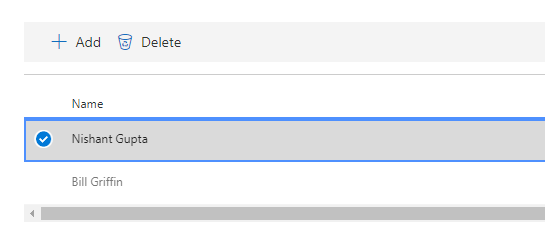

# <a name="work-with-microsoft-compliance-manager-preview"></a>Trabalhar com o Microsoft Compliance Manager (versão prévia)

> [!IMPORTANT]
> O gerente de conformidade da Microsoft é um painel e uma ferramenta de gerenciamento que fornece um resumo de seus Stature de proteção e conformidade de dados e recomendações para melhorar a proteção e conformidade dos dados. As ações do cliente fornecidas no gerente de conformidade são recomendações; a sua organização pode avaliar a eficácia dessas recomendações em seu respectivo ambiente normativo antes da implementação. As recomendações encontradas no Gerenciador de conformidade não devem ser interpretadas como garantia de conformidade.

## <a name="access-compliance-manager"></a>Gerenciador de conformidade do Access

Acesse o Gerenciador de Conformidade no Portal de Confiança do Serviço. Qualquer pessoa com uma conta Microsoft ou uma conta organizacional do Azure Active Directory pode acessar o Gerenciador de Conformidade.
  
1. Acesse [https://servicetrust.microsoft.com](https://servicetrust.microsoft.com/).

2. Entre com sua conta de serviço Microsoft. Esta é a conta de usuário do Office 365, Microsoft 365 ou Azure Active Directory (Azure AD).

3. No portal de confiança do serviço, selecione **Gerenciador de conformidade**. Esta é a versão de visualização do Gerenciador de conformidade. O **Gerenciador de conformidade (clássico)** é o link para a versão anterior do Gerenciador de conformidade.

4. Quando o contrato de não divulgação for exibido, leia-o e selecione **aceitar** para continuar. Você deve concordar uma vez e, em seguida, o painel Gerenciador de conformidade é exibido.

Para começar, uma avaliação ISO/IEC 27001:2103 para o Office 365 aparece por padrão para sua organização.

## <a name="administration"></a>Administração

Há funções administrativas específicas que só estão disponíveis para o administrador de locatários e visíveis somente quando o logon é feito com uma conta de administrador global. No entanto, até que o administrador atribua funções do Gerenciador de conformidade aos usuários, os dados no Gerenciador de conformidade são visíveis para todos os usuários em sua organização. É recomendável implementar o controle de acesso baseado em função para determinar quem pode acessar e realizar ações no Gerenciador de conformidade.
  
### <a name="assigning-compliance-manager-roles-to-users"></a>Atribuir funções do Gerenciador de Conformidade aos usuários

Cada função do gerente de conformidade tem permissões levemente diferentes. Você pode exibir as permissões atribuídas a cada função, ver quais usuários estão em quais funções e adicionar ou remover usuários dessa função através do portal de confiança do serviço. Selecione o item de menu **administrador** e escolha **configurações** para exibir.
  

  
Para adicionar ou remover usuários das funções do Gerenciador de Conformidade.
  
1. Acesse [https://servicetrust.microsoft.com](https://servicetrust.microsoft.com).

2. Entre com sua conta de administrador global do Azure Active Directory.

3. Na barra de menus superior do portal de confiança do serviço, selecione **administrador** e, em seguida, escolha **configurações**.

4. Na lista suspensa **selecionar função** , selecione a função que você deseja gerenciar.

5. Os usuários adicionados a cada função são listados na página **selecionar função** .

6. Para adicionar usuários a essa função, selecione **Adicionar**. Na caixa de diálogo **Adicionar usuários** , selecione o campo usuário. Você pode rolar pela lista de usuários disponíveis ou começar a digitar o nome do usuário para filtrar a lista com base no seu termo de pesquisa. Selecione o usuário para adicionar essa conta à lista de **Adicionar usuários** fornecida com essa função. Se quiser adicionar vários usuários simultaneamente, comece a digitar um nome de usuário para filtrar a lista e, em seguida, selecione o usuário a ser adicionado à lista. Selecione **salvar** para provisionar a função selecionada para esses usuários. 

    
  
7. Para remover usuários dessa função, selecione os usuários e selecione **excluir**.

    

## <a name="groups"></a>Grupos

Os grupos permitem que você organize de forma lógica as avaliações e compartilhe tarefas comuns de informações e fluxo de trabalho entre avaliações que têm o mesmo ou controles relacionados gerenciados pelo cliente. Você pode agrupar avaliações por ano, padrão, serviço, equipe, divisão ou agências dentro de sua organização para ajudar a minimizar ações gerenciadas pelo cliente:
  
- **O FFIEC é avaliações de 2019**
  - Office 365 + FFIEC é
  - Intune + FFIEC é
- **As avaliações de privacidade e segurança de dados**
  - Office 365 + ISO 27001:2013
  - Office 365 + ISO 27018:2014

Ao criar uma nova avaliação, você deve criar um novo grupo para a avaliação ou atribuir a avaliação a um grupo existente. Os grupos não podem ser criados como entidades autônomas. É recomendável que você determine uma estratégia de agrupamento para sua organização *antes* de adicionar novas avaliações. Por padrão, um grupo chamado "grupo padrão" está disponível para suas avaliações iniciais. Os grupos não têm propriedades de segurança. Todas as permissões são associadas a avaliações.

Ao trabalhar com grupos, lembre-se:
  
- Controles de avaliação relacionados em avaliações diferentes no mesmo grupo são atualizados automaticamente quando concluído.
- Novos grupos podem copiar informações de um grupo existente quando você cria uma nova avaliação. Qualquer informação adicionada aos detalhes de implementação e o plano de teste e os campos de resposta de gerenciamento dos controles gerenciados pelo cliente de avaliações no grupo de que você está copiando são copiados para os mesmos controles gerenciados pelo cliente (ou relacionados) no novo Estimativa. Se você estiver adicionando uma nova avaliação a um grupo existente, as informações comuns de avaliações nesse grupo serão copiadas para a nova avaliação.
- Os nomes de grupo (também chamados de *IDs de grupo*) devem ser exclusivos em sua organização.
- Os grupos podem conter Avaliações para a mesma certificação/regulamentação, mas cada grupo só pode conter uma avaliação para um par específico de serviço/certificação na nuvem. Por exemplo, um grupo não pode conter duas avaliações para o Office 365 e o NIST CSF. Um grupo pode conter várias avaliações para o mesmo serviço de nuvem somente se a certificação/regulamentação correspondente de cada um for diferente.
- Após a adição de uma avaliação a um grupo de avaliação, o agrupamento não poderá ser alterado. Você pode renomear o grupo de avaliação, que altera o nome do agrupamento de avaliação para todas as avaliações associadas a esse grupo. Você pode criar uma avaliação e um novo grupo de avaliação e copiar informações de uma avaliação existente, o que cria efetivamente uma duplicata dessa avaliação em um grupo de avaliação diferente.
- O arquivamento de uma avaliação interrompe a relação entre essa avaliação e o grupo. Todas as outras atualizações de outras avaliações relacionadas não serão mais refletidas na avaliação arquivada.

## <a name="tenant-management"></a>Gerenciamento de locatário

O Gerenciador de conformidade (visualização) inclui uma nova interface para gerenciar novos elementos de dados chamados **Gerenciamento**de locatários. Esta interface permite que você gerencie as configurações de todos os locatários:

- **Dimensões:** Exibir, adicionar e personalizar metadados para modelos, avaliações e itens de ação que permitem que você crie pivôs personalizados para filtros.
- **Proprietários:** Especifique um proprietário para cada item de ação.
- **Ações do cliente:** Gerencie a lista completa de itens de ações incluídas no Gerenciador de conformidade (visualização) e habilite/desabilite o monitoramento de Pontuação segura para ações integradas à pontuação segura.

Selecione **Gerenciamento de locatário** para abrir a interface de gerenciamento e use as etapas a seguir para gerenciar **dimensões**, **proprietários**e **ações do cliente**.

### <a name="dimensions"></a>Dimensões

As dimensões são conjuntos de metadados que fornecem informações sobre um modelo, uma avaliação ou um item de ação. As dimensões usam o conceito de chaves e valores, onde a chave de dimensão representa uma propriedade e o valor de dimensão representa valores válidos para a propriedade. Por exemplo, no Gerenciador de conformidade há três tipos de ações. Eles são definidos por uma chave de dimensão do **tipo de ação** e dos valores de dimensão da **documentação**, **operacional**e **técnica**. Você pode modificar as dimensões existentes ou adicionar suas próprias. A adição de dimensões é sempre necessária ao importar modelos personalizados.

#### <a name="add-a-dimension"></a>Adicionar uma dimensão

1. Abra o **Gerenciamento** de locatários e selecione **dimensões**.
2. Selecione **+ Adicionar dimensão**.
3. Insira um nome exclusivo no campo de **chave** .
4. Opcionalmente, habilite vários valores para serem usados simultaneamente para a mesma chave, deslize a opção para **permitir que a seleção múltipla para dimensões** seja ativada.
5. Selecione **+ Adicionar** para adicionar um valor fornecendo um nome exclusivo e clicando no ícone salvar.
6. Repita a etapa 5 para cada valor que você deseja adicionar.
7. Selecione **salvar** para salvar a nova dimensão.

#### <a name="edit-a-dimension"></a>Editar uma dimensão

Você pode renomear uma chave de dimensão, mas pode modificar os valores de dimensões personalizadas.

1. Abra o **Gerenciamento** de locatários e selecione **dimensões**.
2. Localize a dimensão que você deseja editar, selecione as reticências (...) ao lado dela e selecione **Editar**.
3. Selecione **+ Adicionar** para adicionar um valor fornecendo um nome exclusivo e clicando no ícone salvar ou selecione o valor que você deseja editar ou excluir e selecione **remover** ou **Editar**.
4. Selecione **salvar** quando terminar de fazer as alterações.

#### <a name="delete-a-dimension"></a>Excluir uma dimensão

Você pode excluir dimensões personalizadas, se necessário.

1. Abra o **Gerenciamento** de locatários e selecione **dimensões**.
2. Localize a dimensão que você deseja excluir, selecione as reticências (...) ao lado dela e selecione **excluir**.
3. Quando a mensagem de confirmação for exibida, selecione **excluir**.

### <a name="owners"></a>Proprietários

Os proprietários são usados para identificar a parte responsável de cada controle. Todos os controles internos são de propriedade da Microsoft, de clientes ou de ambos. Você pode criar valores personalizados para proprietários que podem ser usados para especificar responsabilidades mais granulares em sua organização. Por exemplo, você pode criar proprietários que representam grupos específicos, equipes ou unidades de negócios dentro de sua organização.

#### <a name="add-an-owner"></a>Adicionar um proprietário

1. Abra o **Gerenciamento** de locatários e selecione **proprietários**.
2. Selecione **+ Adicionar proprietário**.
3. Forneça um nome e uma descrição para o proprietário e selecione **salvar**. A descrição é exibida na coluna proprietário.

#### <a name="edit-an-owner"></a>Editar um proprietário

Não é possível editar o nome de um proprietário, mas você pode modificar a descrição que é exibida na coluna proprietário.

1. Abra o **Gerenciamento** de locatários e selecione **proprietários**.
2. Localize o proprietário que você deseja editar, selecione as reticências (...) ao lado dela e selecione **Editar**.
3. Modifique a descrição conforme necessário e selecione **salvar**.

#### <a name="delete-an-owner"></a>Excluir um proprietário

1. Abra o **Gerenciamento** de locatários e selecione **proprietários**.
2. Localize o proprietário que você deseja excluir, selecione as reticências (...) ao lado dela e selecione **excluir**.
3. Quando a mensagem de confirmação for exibida, selecione **excluir**.

### <a name="customer-actions"></a>Ações do cliente

A área ações do cliente mostra todas as ações do cliente para todos os modelos e avaliações no Gerenciador de conformidade (visualização).


Em resumo, você pode ver o título, proprietário, categoria, imposição e pontuação de uma ação e determinar se ele está integrado à pontuação segura. Você pode expandir uma ação e selecionar **ler mais** para ler a descrição da ação e acessar todos os links na descrição. Você também pode usar essa interface para habilitar e desabilitar a integração de Pontuação segura em uma base por ação e para adicionar ações personalizadas. As ações com recursos de integração de Pontuação segura têm reticências (...) ao lado delas (Observe que as ações personalizadas também têm reticências ao lado delas).

#### <a name="enable-or-disable-secure-score-integration"></a>Habilitar ou desabilitar a integração de Pontuação segura

1. Selecione as reticências (...) da ação que você deseja modificar e selecione **Editar**.
2. Alterne a opção de atualização contínua de Pontuação segura para ativado ou desativado para habilitar ou desabilitar o monitoramento contínuo por meio de Pontuação segura.
3. Selecione **Salvar**.

#### <a name="add-a-customer-action"></a>Adicionar uma ação de cliente

1. Selecione **+ Adicionar ação do cliente**.
2. Forneça um título exclusivo para a ação no campo **título** .
3. Forneça uma pontuação de conformidade para a ação no campo **Pontuação de conformidade máxima** (pode ser qualquer número de 1-99).
4. Use o menu suspenso de **tipo de ação** para especificar o tipo de ação que você está adicionando. Se o tipo de ação não existir, você poderá adicioná-lo adicionando o valor à chave de dimensão de tipo de ação.
5. Use a lista suspensa **dimensões** para especificar ou adicionar valores e chaves de dimensão para a ação.
6. Use o menu suspenso **proprietário** para especificar o proprietário da ação.
7. Selecione **+** para adicionar um título de descrição e descrição para a ação.
8. Selecione o **X** para fechar a folha de descrição.
9. Selecione **salvar** para salvar a ação do cliente.

#### <a name="edit-a-customer-action"></a>Editar uma ação de cliente

1. Selecione as reticências (...) da ação que você deseja modificar e selecione **Editar**.
2. Edite a ação conforme desejado e selecione **salvar**.

#### <a name="delete-a-customer-action"></a>Excluir uma ação de cliente

1. Selecione as reticências (...) da ação que você deseja modificar e selecione **excluir**.
2. Quando a mensagem de confirmação for exibida, selecione **excluir**.

## <a name="assessments"></a>Avaliações

### <a name="add-an-assessment"></a>Adicionar uma avaliação
  
1. No painel de avaliações, selecione **+ Adicionar avaliação**.

2. Quando a lâmina for aberta, insira as seguintes informações:

    - **Título (obrigatório):** Insira um título para a avaliação
    - **Selecione um modelo (obrigatório):** Selecionar um modelo padrão ou personalizado
    - **Selecione um grupo ou adicione um novo grupo (obrigatório):** Selecione um grupo existente ou escolha Adicionar um novo grupo e forneça um nome de grupo exclusivo
    - **Você gostaria de copiar os dados de um grupo existente? (opcional):** alternar o controle para habilitar a cópia de grupo e, em seguida:
        - **Selecione um grupo (opcional):** Se a cópia do grupo estiver habilitada, selecione o grupo do qual copiar
            - **Detalhes da implementação (opcional):** Selecione para copiar os detalhes de implementação para o novo grupo
            - **Plano de teste & informações adicionais (opcional):** Selecione para copiar o plano de teste e detalhes de informações adicionais para o novo grupo
            - **Documentos (opcional):** Selecionar para copiar documentos para o novo grupo

3. Selecione **salvar** para criar a avaliação.

 A nova avaliação aparece no painel de avaliação e exibe as seguintes informações:

- O título da avaliação.
- As dimensões da avaliação, incluindo a certificação, o ambiente e o produto aplicados à avaliação.
- A data em que foi criada e a data em que foi modificada pela última vez.
- A pontuação de avaliação mostrada como uma porcentagem.
- Indicadores de progresso que mostram o número de controles avaliados pela Microsoft e gerenciados pelo cliente.

### <a name="copying-information-from-existing-assessments"></a>Copiar informações de avaliações existentes

Ao criar uma avaliação, você tem a opção de copiar informações de um grupo existente. Isso permite que você aplique as informações inseridas na avaliação copiada para os mesmos controles na nova avaliação. Por exemplo, se você tiver um grupo para todas as avaliações relacionadas a FFIEC em sua organização, você pode copiar as seguintes informações de avaliações existentes:

- Detalhes da implementação
- Plano de teste & informações adicionais
- Documentos

#### <a name="copy-information-from-an-existing-assessment-to-a-new-assessment"></a>Copiar informações de uma avaliação existente para uma nova avaliação
  
1. No painel de avaliação, selecione **+ Adicionar avaliação**.
    
2. Na janela **Adicionar uma avaliação** , preencha as seguintes informações

    - **Título (obrigatório):** Insira um título para a avaliação.
    - **Selecione um modelo (obrigatório):** Selecione um modelo padrão ou personalizado.
    - **Selecione um grupo ou adicione um novo grupo (obrigatório):** Escolha **Adicionar um novo grupo** e forneça um nome de grupo exclusivo.
    - **Você gostaria de copiar os dados de um grupo existente? (opcional):** ativar/desativar o controle para habilitar a cópia de grupo e:- **Selecione um grupo (opcional):** se a cópia do grupo estiver habilitada, selecione o grupo a partir do qual copiar.
            - **Detalhes da implementação (opcional):** Selecione para copiar os detalhes de implementação para o novo grupo.
            - **Plano de teste & informações adicionais (opcional):** Selecione para copiar o plano de teste e detalhes de informações adicionais para o novo grupo.
            - **Documentos (opcional):** Selecione para copiar documentos para o novo grupo.

3. Selecione **salvar** para criar a avaliação.

### <a name="viewing-assessments"></a>Como exibir avaliações

#### <a name="view-an-assessment"></a>Exibir uma avaliação
  
1. No painel de avaliações, selecione o nome da avaliação para abri-lo e exibir as informações sobre itens de ação e controles.

Veja um exemplo da avaliação do Office 365 e ISO 27001. O primeiro modo de exibição ilustra o novo modo de exibição itens de ação no Gerenciador de conformidade (visualização).


As ações são listadas em ordem alfabética e cada ação é atribuída a uma pontuação e um proprietário. Selecione o link **ler mais** para ler os detalhes de cada ação. 


Selecione o **** link revisar para gerenciar, atribuir, implementar e testar a ação. Veja a seguir um exemplo de ação.


Nas versões anteriores do Gerenciador de conformidade, o fluxo de trabalho para implementar os requisitos foi executado no nível de controle. Um responsável pela conformidade atribuiria um controle a alguém para implementar o controle. Houve duas desvantagens a isso:

- Os controles geralmente tinham várias ações associadas e o usuário ao qual um controle foi atribuído, pode não ser a pessoa certa para concluir todas as ações necessárias à implementação do controle
- Combinar tarefas separadas em uma única ação impedia o conjunto de sinais e telemetria usados para registrar automaticamente alterações de configuração de locatário no Gerenciador de conformidade (visualização).

No Gerenciador de conformidade (visualização), o processo de fluxo de trabalho foi movido do nível de controle para o nível de ação. Ao revisar uma ação, os campos a seguir podem ser usados para gerenciar o fluxo de trabalho de ação:

- **Atribuir usuário:** Selecione este campo para escolher ou inserir o usuário ao qual esta ação deve ser atribuída. Você pode rolar pela lista ou digitar um nome para localizá-lo e, em seguida, selecioná-lo.
- **Gerenciar documentos:** Você pode carregar evidências de implementação na forma de documentos do Office, arquivos de imagem e capturas de tela, saída do PowerShell em CSV ou TXT e PDFs.
- **Status da implementação:** Usado para indicar o status de implementação atual da ação. Os valores possíveis não são implementados, implementados, implementação alternativa, planejado e não no escopo.
- **Data de implementação:** A data na qual a ação foi realizada.
- **Resultado do teste:** Usado para indicar os resultados da validação da implementação. Os valores possíveis não são avaliados, aprovados, risco de falha-baixo, risco de falha médio, falha-alto risco e não em escopo.
- **Data do teste:** A data na qual a validação ocorreu.
- **Notas de implementação:** Insira os detalhes de implementação da sua organização, juntamente com as anotações que você deseja incluir.
- **Plano de teste:** Insira os detalhes do plano de teste para esta ação, juntamente com as anotações que você deseja incluir.
- **Informações adicionais:** Insira qualquer informação adicional sobre esta ação ou como ela foi implementada em sua organização, juntamente com as anotações que você deseja incluir.

O Gerenciador de conformidade (visualização) também inclui a tabela dinâmica baseada em controle encontrada em versões anteriores. Selecione o painel de **informações de controles** para exibi-lo. Você pode exibir informações de controles na avaliação e no nível do modelo. Veja a seguir um exemplo do painel de informações de controles para avaliações.


Para avaliações, o painel de informações de controles é exibido:

- Um menu suspenso de **grupo** para selecionar qual grupo exibir (ao usar vários grupos).
- Uma lista suspensa de **avaliação** para selecionar a avaliação a ser visualizada.
- Metadados sobre a avaliação selecionada, incluindo:
    - Um indicador de progresso para **controles avaliados** mostrando o número de controles avaliados sobre o número total de controles.
    - A **Pontuação de conformidade** atual da avaliação, mostrada como uma porcentagem.
    - Detalhes sobre a **certificação** e o **produto** usados na avaliação.
    - O **status** atual e a data da última **modificação** da avaliação.
- Uma lista dos **serviços de escopo** para avaliação.
- Detalhes dos controles, agrupados por família de controle, com links para ações do cliente e detalhes da implementação da Microsoft:
    - **Suas ações** exibe as ações do cliente que você pode executar para satisfazer alguns ou todos os requisitos do controle. Muitos controles têm várias ações associadas a eles, e todas as ações associadas a um controle são exibidas aqui. As ações aqui têm a mesma interface do usuário listadas no painel Ações.
    - **Microsoft Actions** exibe a lista de controles da estrutura interna da Microsoft que se aplicam ao controle de certificação selecionado. Para cada controle interno, selecione **implementado** para ver os detalhes de implementação e teste da Microsoft, juntamente com o resultado do teste e a data de teste, conforme mostrado abaixo.


### <a name="export-an-assessment"></a>Exportar uma avaliação

Você pode exportar uma avaliação para um arquivo do Excel para stakeholders de conformidade em sua organização ou para auditores externos e reguladores. O relatório é um instantâneo da avaliação a partir da data e hora em que o relatório foi criado. O relatório contém os detalhes de todos os controles da Microsoft e gerenciados pelo cliente para avaliação, o status da implementação do controle, a data de teste de controle, os resultados do teste e fornece links para documentos de evidência carregados. Você deve exportar o relatório de avaliação antes de arquivar uma avaliação porque as avaliações arquivadas não mantêm links para documentos carregados.
  
### <a name="export-an-assessment-report"></a>Exportar um relatório de avaliação
  
1. No painel do Gerenciador de conformidade, selecione a guia **informações sobre controles** .
2. Selecione o **grupo** e a **avaliação** nos menus suspensos da avaliação que você deseja exportar.
3. Selecione o botão **Exportar** .

O relatório de avaliação é baixado como um arquivo do Excel na sessão do navegador. O nome dos arquivos para o arquivo do Excel padrão é o título da avaliação.

### <a name="archive-a-template-or-an-assessment"></a>Arquivar um modelo ou avaliação

Quando você tiver concluído um modelo ou avaliação e não precisar mais dele para fins de conformidade, você poderá arquivá-lo. Quando um modelo ou avaliação é arquivado, ele é removido do modo de exibição padrão e você deve marcar a caixa de seleção Mostrar arquivo morto para exibi-la.


  
> [!IMPORTANT]
> As avaliações arquivadas não mantêm seus links para documentos de evidência carregados. É altamente recomendável que você exporte a avaliação antes de arquivamento para manter links para os documentos de evidência no relatório.
  
#### <a name="archive-a-template"></a>Arquivar um modelo

1. Abra o painel de **modelos** .
2. Localize o modelo que você deseja arquivar e selecione o ícone de arquivo morto.
3. Ao ver a mensagem de confirmação, selecione **arquivo morto**.

#### <a name="archive-an-assessment"></a>Arquivar uma avaliação

1. Abra o painel de **avaliações** .
2. Selecione o **grupo** na lista suspensa que contém a avaliação que você deseja arquivar.
3. Localize a avaliação que você deseja arquivar e selecione o ícone de arquivo morto.
4. Ao ver a mensagem de confirmação, selecione **arquivo morto**.

#### <a name="view-archived-assessments"></a>Exibir avaliações arquivadas
  
1. Abra a guia painel de **avaliações** e marque a caixa de seleção **Mostrar arquivo morto** .
2. As avaliações arquivadas aparecem na seção **avaliações arquivadas** .
3. Selecione o nome da avaliação para abrir e exibir a avaliação.

#### <a name="activate-an-archived-assessment"></a>Ativar uma avaliação arquivada

1. Na guia **avaliações** e selecione a caixa de seleção **Mostrar arquivo morto** .
2. As avaliações arquivadas aparecem na seção **avaliações arquivadas** .
3. Localize a avaliação que você deseja ativar e selecione o ícone ativar.
4. Ao ver a mensagem de confirmação, selecione **Ativar**.

## <a name="controls-and-actions"></a>Controles e ações

Controles e ações são os dados dinâmicos principais usados no Gerenciador de conformidade (visualização). O controle pivot, que existiu em versões anteriores do gerente de conformidade, foi aprimorado para mostrar os controles da Microsoft e de cliente nas mesmas famílias de controle. Esse modo de exibição consolidado facilita a visualização do modelo de responsabilidade compartilhada completo em uma base por controle. A ação Pivot é nova no Gerenciador de conformidade (prévia) e foi projetada para fornecer uma visão simplificada de todas as ações recomendadas pela Microsoft.

### <a name="controls"></a>Controles

Os controles podem ser exibidos no painel de informações de controles. Os controles representam os requisitos de um padrão, certificação, regulamentação ou estrutura. Para mapear esses requisitos entre vários padrões, regulamentações, etc., e para associá-los a ações, tudo é tratado como se fosse uma estrutura de controle. Por exemplo, como uma estrutura de controle, as regulamentações, como HIPAA, foram divididas por seção e os controles HIPAA no gerente de conformidade usam o mesmo esquema de numeração que essas seções, conforme mostrado abaixo:


Há três tipos de controles. Dois são fornecidos pela Microsoft nos modelos internos, e o terceiro é criado e gerenciado por clientes em modelos personalizados. Os três tipos são:

1. **Controles gerenciados pela Microsoft (mm):** são controles para os quais somente a Microsoft tem responsabilidade. Eles aparecem nos modelos da caixa de entrada e são adicionados ao gerente de conformidade da Microsoft.
2. **Controles gerenciados pelo cliente (cm):** são controles para os quais somente os clientes têm responsabilidade. Eles aparecem nos modelos da caixa de entrada e são adicionados ao gerente de conformidade da Microsoft ou dos clientes. O cliente também pode editar ou desabilitar os controles gerenciados pelo cliente fornecidos pela Microsoft.
3. **Controles compartilhados (SM):** são controles onde a responsabilidade é compartilhada entre a Microsoft e o cliente. Eles aparecem nos modelos da caixa de entrada e são adicionados ao Gerenciador de conformidade da Microsoft.

### <a name="actions-items"></a>Itens de ações

Itens de ações são as tarefas recomendadas para a implementação dos requisitos de um padrão ou regulamento, ou para testar, verificar e documentar os requisitos de implementação da sua organização. As ações são associadas a um ou mais controles. Cada controle tem uma ou mais ações associadas a ele, e cada ação pode ser associada a um ou mais controles. As ações fazem parte do fluxo de trabalho principal no Gerenciador de conformidade (visualização), já que são os objetos atribuídos, controlados e validados pela organização.

#### <a name="assign-action-items"></a>Atribuir itens de ação
  
1. No painel **itens de ação** , selecione o **grupo** que contém a (s) avaliação (ões) cuja ação você deseja atribuir.
2. Na lista suspensa de **avaliação** , selecione a avaliação cuja ação você deseja atribuir ou selecione **todas** na lista suspensa para ver todas as ações disponíveis.
3. Localize a ação que você deseja atribuir e, na coluna **proprietário** , selecione o link para **revisão**, **implementado** ou **testar**.
4. Selecione o campo **atribuir usuário** e uma lista de usuários em sua organização aparecerá. Role a lista e selecione usuário ou filtro a lista para selecionar um usuário digitando o nome do usuário.
5. No campo notas de implementação, insira as anotações que você deseja transmitir para o usuário atribuído.
6. Selecione **salvar** para atribuir a ação.

#### <a name="reassign-action-items"></a>Reatribuir itens de ação

Essa função permite que uma organização remova as dependências ativas ou pendentes da conta de usuário Reatribuindo uma ação a um novo usuário.

1. No painel **itens de ação** , selecione o **grupo** que contém a (s) avaliação (ões) cuja ação você deseja reatribuir.
2. Na lista suspensa de **avaliação** , selecione a avaliação cuja ação você deseja reatribuir ou selecione **todas** na lista suspensa para ver todas as ações disponíveis.
3. Localize a ação que você deseja reatribuir e, na coluna **proprietário** , selecione o link para **revisão**, **implementação**ou **teste**.
4. Exclua o usuário existente do campo **atribuir usuário** e escolha um usuário diferente na lista de usuários ou filtre a lista para selecionar um usuário digitando o nome do usuário.
5. No campo notas de implementação, insira as anotações que você deseja transmitir para o usuário.
6. Selecione **salvar** para reatribuir a ação.

## <a name="templates"></a>Modelos

Um modelo é o objeto base no Gerenciador de conformidade (visualização) associado a um produto e uma certificação (por exemplo, padrão, regulamento, estrutura de controle, etc.). Os modelos podem ser exibidos e adicionados a partir do painel modelos.


 
O painel exibe cada modelo, juntamente com a certificação e o produto associados ao modelo, as datas em que o modelo foi criado e modificado pela última vez, o número de controles gerenciados pelo cliente e pela Microsoft, a pontuação de conformidade máxima para o Modelo e o status do modelo (por exemplo, aprovado, aprovação pendente, importado).

Cada um dos modelos internos tem uma avaliação interna associada a eles, mas você pode criar avaliações adicionais com base nos modelos internos e pode importar seus próprios modelos e criar avaliações personalizadas com base nesses modelos e em uma avaliação personalizada.

### <a name="create-a-template"></a>Criar um modelo

Você pode criar um modelo copiando um modelo existente ou importando um modelo personalizado. Há um formato e esquema específicos que devem ser usados para os dados de modelo ou que não serão importados para o Gerenciador de conformidade. Um arquivo com o esquema e os dados de exemplo corretos podem ser baixados deste local.
Cada modelo personalizado deve estar em uma pasta de trabalho do Excel separada (no formato. xls ou. xlsx) que contém cinco guias:

1. Modelo-avaliação
2. ControlFamily
3. Ações
4. Propriedade
5. Dimensões

O esquema usado em cada guia é detalhado abaixo.

#### <a name="template-assessment-tab"></a>Modelo-guia avaliação

Esta guia tem uma única coluna:

- **** inscopeservices: lista delimitada por vírgula de produtos ou serviços que estão no escopo para o modelo.

#### <a name="controlfamily-tab"></a>Guia ControlFamily

Essa guia inclui colunas que definem os controles que são mapeados para as ações listadas na guia ações e inclui detalhes como o nome do controle, família, título e descrição.  As colunas dessa guia, que devem ser ordenadas no Excel na ordem listada abaixo, são: 

- **ControlName:** Nome do controle de certificação/padrão/regulamentação, etc.
- **controlFamily:** Família de controle do Certification/Standard, regulamento, etc.
- **controlTitle:** Título de controle de certificação/padrão/regulamentação, etc.
- **controlDescription:** Descrição de controle de Certification/Standard/regulamento, etc.
- **controlVersion:** Informações de versão do controle opcional.  Exemplo: para o NIST 800-53, o valor atual é Rev 4, portanto, o controlVersion é 4.  Para CCM CSA, ele é o 3.0.1.
- **IsDisabled:** Use TRUE ou FALSE para indicar se o controle foi desabilitado.
- **ControlType:** Use o CM para indicar que esses são controles gerenciados pelo cliente.
- **controlComplianceScore:** Soma da Pontuação de todas as ações atribuídas ao controle.
- **controlActionTitle:** Lista delimitada por ponto-e-vírgula duplo de todos os actionTitles para esse controle, conforme listado na guia ações. 

#### <a name="actions-tab"></a>Guia ações

Essa guia inclui colunas que definem ações individuais e inclui detalhes como título da ação, propriedade e dimensões. As colunas dessa guia, que devem ser ordenadas no Excel na ordem listada abaixo, são: 

- **actionTitle:** Título da ação. Cada título deve ser exclusivo e é recomendável usar o caso do Pascal.
- **actionRelatedODVs:** Lista delimitada por ponto-e-vírgula duplo de actionTitles que são pais do filho listados na coluna actionTitle. Em uma relação pai/filho, o pai representa a marca d' água alta. Portanto, se você concluir uma ação pai, também concluirá todas as ações filhas. Por exemplo, quando você tem requisitos semelhantes, mas valores definidos por padrão diferentes, como comprimento da senha, onde um padrão/regulamento requer um mínimo de 15 caracteres, e outro requer um mínimo de 12 ou 10. 15 seria o pai neste exemplo e, se você configurar um mínimo de 15 caracteres, também atenderá às ações que recomende 12 ou 10 caracteres em outras avaliações.

    > [!NOTE]
    > A coluna actionRelatedODVs é uma coluna obrigatória para o esquema; no entanto, o recurso (ações relacionadas) não está disponível no Gerenciador de conformidade (visualização).  Ele está agendado para ser adicionado em uma versão posterior.

- **actionDimensionValues:** Lista delimitada por ponto-e-vírgula duplo de dimensões aplicáveis da guia dimensões, usando o seguinte formato:

    ```
    Dimension Key::Dimension Value;;Dimension Key::Dimension Value.
    ```
    
    Por exemplo:

    ```
    Product::Office 365;;Certification::NIST CSF
    ```

    Todas as dimensões usadas em um modelo personalizado devem estar listadas na guia dimensões do arquivo de importação, mesmo se já estiverem listadas no painel dimensões. Se você estiver adicionando novas chaves de dimensão ou valores, você deve adicioná-los primeiro ao painel de dimensões.
- **actionScore:** Valor numérico para cada ação, que representa a pontuação dessa ação. Recomendamos seguir o modelo de Pontuação usado pelas avaliações internas, que se baseia no propósito e na aplicação de cada ação.
- **actionOwnership:** Lista de proprietários delimitadas por ponto e vírgula. Todos os proprietários listados devem ser incluídos na guia propriedade.
- **actionDescription:** Texto de cada ação, que deve ser exclusivo. Este campo suporta o idioma de redução, conforme descrito abaixo.

#### <a name="ownership-tab"></a>Guia Propriedade

Essa guia inclui colunas que definem proprietários para cada ação.  As colunas dessa guia, que devem ser ordenadas no Excel na ordem listada abaixo, são:

- **propriedadeName:** Nome exclusivo do proprietário/parte responsável.
- **ownershipDescription:** Descrição do proprietário/parte responsável.

#### <a name="dimensions-tab"></a>Guia dimensões

Essa guia inclui colunas que definem as dimensões que podem ser associadas a uma ação.  As colunas dessa guia, que devem ser ordenadas no Excel na ordem listada abaixo, são:

- **dimensionKey:** Lista de chaves usadas para dimensões. Por exemplo, produto, certificação, etc.
- **dimensionvalue:** Valor exclusivo para cada chave de dimensão. Por exemplo, Office 365, Intune, Azure, produto personalizado, etc.
- **allowMultiSelect:** Use TRUE ou FALSE para indicar que vários valores de dimensão podem ser selecionados para uma única chave de dimensão.

#### <a name="using-markdown-language-in-description-fields"></a>Usando o idioma de redução nos campos de descrição

Os modelos e as avaliações dão suporte ao uso do idioma de redução para alguns elementos de texto e formatação.  Há três elementos de formatação de idiomas de redução usados no Gerenciador de conformidade:

- Listas de marcadores e numeradas
- Hiperlinks
- Exibidas

Os marcadores são representados como asteriscos em vez de marcadores do Word ou Excel. Por exemplo:

```
* Item A
* Item B
* Item C
```

Os números são representados como números, mas com espaços para recuo (três espaços por nível) e apenas números usados para todos os subníveis (por exemplo, sem letras).  Por exemplo:
   1. Item A
   2. Item B
      1. Subitem A
      2. Subitem B
   3. Item C
   4. Item D
      1. Subitem A
      2. Subitem B
   5. Item E

Os hiperlinks são construídos colocando-se entre colchetes ao redor do texto do hiperlink e do hiperlink em si, em parênteses imediatamente ao lado do colchete de fechamento.  Por exemplo:

```
Click [here](https://www.microsoft.com) to go to Microsoft’s home page.
```
Este texto é renderizado da seguinte maneira: clique [aqui](https://www.microsoft.com) para ir para a Home Page da Microsoft.
Conforme mostrado no exemplo acima, o Gerenciador de conformidade não renderiza URLs com sublinhado.

O texto em negrito é apenas dois asteriscos em cada lado do texto a ser negrito.  Por exemplo:

```
**This text will render in bold**
```
**Este texto é renderizado em negrito**

### <a name="create-a-template"></a>Criar um modelo

Você pode criar um modelo copiando um modelo existente ou importando dados de modelo do Excel. Ao importar dados do Excel, o modelo requer dois administradores de Gerenciador de conformidade diferentes para publicar os dados (um para publicar e um para aprovar).

#### <a name="create-a-template-by-copying-an-existing-template"></a>Criar um modelo copiando um modelo existente

1. Abra o painel de **modelos** e selecione **+ Adicionar modelo**.
2. No campo **Inserir nome do modelo** , forneça um nome exclusivo para o modelo.
3. Marque a caixa de seleção **Copiar de um modelo existente** e selecione o modelo que você deseja copiar da lista suspensa.
4. Opcionalmente, adicione qualquer dimensão adicional.
5. Selecione **Adicionar ao painel**.

#### <a name="create-a-template-by-importing-data"></a>Criar um modelo importando dados

1. Abra o painel de **modelos** e selecione **+ Adicionar modelo**.
2. No campo **Inserir nome do modelo** , forneça um nome exclusivo para o modelo.
3. Adicione uma ou mais dimensões. Mesmo que as dimensões que você usa já estejam listadas no painel de dimensões, elas ainda devem estar listadas no arquivo de importação.
4. Selecione **procurar** para navegar até o local do arquivo de importação, selecione-o e selecione **abrir**.
5. O arquivo de importação será validado e indicará o número de controles e famílias de controle que foram detectados. Se houver erros, um link será fornecido para uma versão modificada do arquivo de importação que inclui detalhes do erro. Todos os erros devem ser resolvidos para que os dados sejam importados.
6. Depois que os dados passarem na validação, selecione **Adicionar ao painel**.
7. O modelo importado aparece no painel **modelos** e tem um status de **** importado. Selecione as reticências (...) e selecione **publicar** para publicar o modelo. Quando a mensagem de confirmação for exibida, selecione **publicar**. O status do modelo muda para **aprovação pendente**.
8. Outro usuário com a função de administrador do gerente de conformidade deve aprovar o modelo no painel modelos. Eles devem selecionar as reticências (...) e selecionar **aprovar**. Quando a mensagem de confirmação for exibida, selecione **aprovar**. O modelo agora está pronto para uso.

### <a name="customize-a-template"></a>Personalizar um modelo

Os modelos podem ser personalizados por meio de outros controles personalizados. Todos os controles personalizados são considerados controles gerenciados pelo cliente.

#### <a name="add-a-custom-control-to-a-template"></a>Adicionar um controle personalizado a um modelo

1. Abra o **modelo** que você deseja modificar.
2. Selecione **+ Adicionar** controle personalizado.
3. Selecione uma **família de controle** na lista suspensa ou insira uma nova família de controle, se ela não existir.
4. Forneça um nome ou ID exclusivo para o controle no campo **ID do controle** .
5. Forneça o título do controle no campo **título** .
6. Forneça os requisitos e outras informações para o controle no campo **Descrição** .
7. Selecione **atribuir** ação do cliente.
8. Localize a (s) ação (ões) que você deseja atribuir ao controle:
    - Use **Filtrar por dimensão** para usar dimensões atribuídas à (s) ação (ões) para localizar e listá-las.
    - Use **Filtrar por proprietário** para usar os proprietários atribuídos à (s) ação (ões) para localizar e listá-los.
    - Selecione um **tipo de ação** no menu suspenso para listar ações por tipo.
    - Insira o título da ação a ser localizada e liste-a.
9. Usando os critérios na etapa 8, uma lista de **ações correspondentes** será exibida. Selecione a primeira ação que você deseja atribuir ao controle.
10. Os detalhes da ação são exibidos. Selecione a **Descrição** que você deseja usar e selecione **concluído**.
11. Repita as etapas 9 e 10 para cada ação adicional que você deseja atribuir.
12. Quando todas as ações aplicáveis forem selecionadas, selecione **atribuir**.
13. Selecione **salvar** para salvar o novo controle.

### <a name="export-a-template-to-json"></a>Exportar um modelo para JSON

O Gerenciador de conformidade (visualização) também oferece suporte à exportação de modelos para o formato JSON (JavaScript Object Notation). Isso permite que você troque os dados do Gerenciador de conformidade com outros sistemas que dão suporte a JSON.

## <a name="reports"></a>Relatórios

Você pode exportar uma avaliação para um arquivo do Excel para stakeholders de conformidade em sua organização ou para auditores externos e reguladores. O relatório é um instantâneo da avaliação a partir da data e hora da exportação. O relatório contém os detalhes do Microsoft e dos controles gerenciados pelo cliente para avaliação, o status da implementação do controle, a data de teste de controle, os resultados do teste e os links para documentos de evidência carregados. Você deve exportar avaliações antes de arquivá-las, pois as avaliações arquivadas não mantêm links para documentos carregados.

### <a name="export-an-assessment"></a>Exportar uma avaliação

1. No painel do Gerenciador de conformidade, selecione a guia **informações sobre controles** .
2. Selecione o grupo e a avaliação nos menus suspensos da avaliação que você deseja exportar.
3. Selecione exportar. A exportação de avaliação é baixada como um arquivo do Excel.


## <a name="permissions"></a>Permissões

A tabela a seguir descreve cada permissão do Gerenciador de conformidade e o que ele permite fazer. A tabela também indica a função que cada permissão é atribuída.

||**Leitor do Gerenciador de Conformidade**|**Colaborador do Gerenciador de Conformidade**|**Consultor do Gerenciador de Conformidade**|**Administrador do Gerenciador de Conformidade**|**Administrador do Portal**|
|:-----|:-----|:-----|:-----|:-----|:-----|
|**Ler dados:** Os usuários podem ler mas não editar dados (exceto para o modelo de dados e gerenciamento de locatários).  <br> | X | X | X | X  | X |
|**Editar dados:** Os usuários podem editar todos os campos, exceto os campos resultado do teste e data de teste (exceto os dados de modelo e o gerenciamento de locatários).  <br> || X | X  | X | X |
|**Edite os resultados do teste:** Os usuários podem editar os campos resultado do teste e data de teste.  <br> ||| X | X | X |
|**Gerenciar avaliações:** Os usuários podem criar, arquivar e excluir avaliações.  <br> |||| X | X |
|**Gerenciar dados mestres:** Os usuários podem exibir, editar e excluir dados de modelo e dados de gerenciamento de locatários.  <br> |||| X | X |
|**Gerenciar usuários:** Os usuários podem adicionar outros usuários em sua organização às funções leitor, colaborador, consultor e administrador. Somente os usuários com a função de administrador global em sua organização podem adicionar ou remover usuários da função de administrador do Portal.  <br> ||||| X |

### <a name="guest-access"></a>Acesso de convidados
  
Após a configuração do acesso ao Gerenciador de conformidade, qualquer usuário que não tenha uma função provisionada estará na função de **acesso de convidado** por padrão (o que também é a experiência de qualquer conta não provisionada pela organização, como contas pessoais da Microsoft). Os usuários de acesso de convidados não têm acesso total a todos os recursos do Gerenciador de conformidade. Eles não podem ver qualquer um dos dados de avaliação de conformidade da organização, no entanto, eles podem usar o Gerenciador de conformidade para exibir os relatórios de avaliação de conformidade e de confiança do serviço da Microsoft.